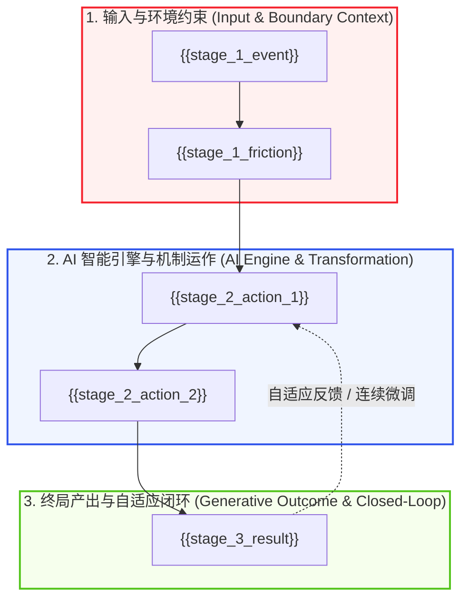

# Non-Normative V8.1 Concept Authoring Guide

> Preserved rich Viking topology and authoring rationale. The canonical runtime template is `system/templates/template-concept-gold-standard-v8.1.md`; this guide is reference material, not a second template authority.

---
title: "{{title}}"
chinese_title: "{{chinese_title}}"
type: concept
contract_version: "8.1.0"
template_id: concept-gold-standard
template_version: "8.1.0"
url: "{{url}}"
author: "{{author}}"
date: "{{source_date}}"
tags:
  - "domain/{{domain_1}}"
  - "domain/{{domain_2}}"
  - "topic/{{topic_1}}"
  - "topic/{{topic_2}}"
  - "type/concept"
  - "maturity/gold"
aliases:
  - "{{title}}"
  - "{{chinese_title}}"
  - "{{alias_3}}"
  - "{{alias_4}}"
status: evergreen
created: "{{created_date}}"
updated: "{{updated_date}}"
knowledge_stage: multi-source
evidence_level: cross-checked # cross-checked / primary-source / single-source
freshness_tier: stable
valid_as_of: "{{valid_as_of}}"
last_verified: "{{last_verified}}"
next_review: "{{next_review}}"
freshness_status: current
source_ids:
  - "{{source_id}}"
ai_profile:
  archetype: "{{ai_archetype}}" # ai-native / ai-enhanced / ai4s / mechanical-interpretability / agentic-workflow
  agentic_readiness: "high" # high / medium / experimental
  compute_intensity: "{{compute_intensity}}" # high / medium / low
  context_layer: "{{context_layer}}" # foundational / operational / meta-governance
contract_checklist:
  core_thesis: true
  evidence_scope: true
  mechanisms: true
  mermaid_diagram: true
  paradigm_matrix: true
  key_data: true
  actionable_sop: true
  agentic_interface: true
  evolution_timeline: true
  open_questions: true
  linkages: true
---

# {{title}} ({{chinese_title}})

> [!NOTE] Core Thesis
> **核心论点 (Core Thesis):** **“{{core_thesis_statement}}”**
> (Source: [[{{source_path}}#^{{thesis_anchor}}]])

^{{concept_slug}}-core-thesis

> [!INFO] Temporal Scope
> Valid as of **{{valid_as_of}}** · freshness tier **{{freshness_tier}}** · next review **{{next_review}}**.

---

## 证据范围 (Evidence Scope)

- **直接证据 (Direct Evidence):**
  1. **{{evidence_1_title}}**：{{evidence_1_detail}}。(Source: [[{{source_path}}#^{{evidence_1_anchor}}]])
  2. **{{evidence_2_title}}**：{{evidence_2_detail}}。(Source: [[{{source_path}}#^{{evidence_2_anchor}}]])
  3. **{{evidence_3_title}}**：{{evidence_3_detail}}。(Source: [[{{source_path}}#^{{evidence_3_anchor}}]])
- **主观解释 (Interpretation):** {{interpretation_summary}}
- **证据边界 (Evidence Boundary):** {{boundary_conditions}}（明确物理/算力/数据分布等约束边界）
- **反证条件 (Falsifiers):** {{falsification_criteria}}（若何种实证数据涌现，则本论点需被修正或推翻）

---

## 核心机制：{{mechanism_headline}} (Core Mechanisms)

- **{{sub_mechanism_1_name}}**：{{sub_mechanism_1_desc}}。(Source: [[{{source_path}}#^{{sub_mech_1_anchor}}]])
- **{{sub_mechanism_2_name}}**：{{sub_mechanism_2_desc}}。(Source: [[{{source_path}}#^{{sub_mech_2_anchor}}]])
- **{{sub_mechanism_3_name}}**：{{sub_mechanism_3_desc}}。(Source: [[{{source_path}}#^{{sub_mech_3_anchor}}]])
- **{{sub_mechanism_4_name}}**：{{sub_mechanism_4_desc}}。(Source: [[{{source_path}}#^{{sub_mech_4_anchor}}]])

### 机制流转拓扑 (Visual Topology)



---

## 📊 范式对比矩阵 (Paradigm Matrix)

| 核心维度 | 传统旧范式 / 表面共识 (Legacy / Baseline) | AI 增强 / AI-Native 黄金范式 (New Gold Paradigm) |
| :--- | :--- | :--- |
| **价值创造核心** | {{legacy_view_1}} | **{{new_view_1}}** |
| **生产力与扩张杠杆**| {{legacy_view_2}} | **{{new_view_2}}** |
| **决策与闭环架构** | {{legacy_view_3}} | **{{new_view_3}}** |
| **单位经济与成本结构**| {{legacy_view_4}} | **{{new_view_4}}** |
| **可观测性与透明度**| {{legacy_view_5}} | **{{new_view_5}}** |
| **系统韧性与防御性**| {{legacy_view_6}} | **{{new_view_6}}** |

---

## 关键数据与实证 (Key Data)

- **{{data_point_1_title}}**：{{data_point_1_desc}}。(Source: [[{{source_path}}#^{{data_1_anchor}}]])
- **{{data_point_2_title}}**：{{data_point_2_desc}}。(Source: [[{{source_path}}#^{{data_2_anchor}}]])
- **{{data_point_3_title}}**：{{data_point_3_desc}}。(Source: [[{{source_path}}#^{{data_3_anchor}}]])

---

## 🤖 智能体接口与可观测性 (Agentic Interface & Queryability)

- **Agent 角色适配 (Archetype):** `{{agent_role}}`（如：自主投研 Agent、代码生成 Agent、实验闭环调度 Agent）
- **工具调用映射 (Tool / MCP Grounding):** `{{tool_or_mcp_mapping}}`（如：调用 `read_file`、`run_sim`、`query_database` 等具身动作）
- **上下文压缩与注入约束 (Context Budget):** 核心知识密度极高，推荐以 `> [!NOTE]` 核心命题及 `^{{concept_slug}}-core-thesis` 块锚点作为零样本注入单元（< 200 Tokens）。
- **可查询工件结构 (Queryable Schema):**
```json
{
  "concept_id": "{{concept_slug}}",
  "domain": "{{domain_1}}",
  "mechanisms": ["{{sub_mechanism_1_name}}", "{{sub_mechanism_2_name}}"],
  "falsifiers": ["{{falsification_criteria}}"],
  "evidence_level": "{{evidence_level}}"
}
```

---

## 🛠️ 人机协同落地指南 (Actionable SOP)

1. **{{sop_step_1_title}}**：{{sop_step_1_desc}}
2. **{{sop_step_2_title}}**：{{sop_step_2_desc}}
3. **{{sop_step_3_title}}**：{{sop_step_3_desc}}
4. **{{sop_step_4_title}}**：{{sop_step_4_desc}}

---

## 📈 演化时间线 (Evolution Timeline)

- **{{timeline_date_1}}：** {{timeline_event_1_desc}}。[[{{source_path_1}}]]
- **{{timeline_date_2}}：** {{timeline_event_2_desc}}。[[{{source_path_2}}]]
- **{{timeline_date_3}}：** 本概念卡片升级至 `concept-gold-standard-v8.1`，完成多源交叉印证与知识闭环。

---

## ❓ 开放问题与前瞻研究 (Open Questions)

1. **{{open_question_1_topic}}**：{{open_question_1_detail}}
2. **{{open_question_2_topic}}**：{{open_question_2_detail}}
3. **{{open_question_3_topic}}**：{{open_question_3_detail}}
4. **{{open_question_4_topic}}**：{{open_question_4_detail}}

---

## 🔗 概念网络连接 (Connections)

### 上游依赖（Upstream Foundations）
- [[{{upstream_concept_1}}]] — {{upstream_concept_1_desc}}
- [[{{upstream_concept_2}}]] — {{upstream_concept_2_desc}}

### 相关并列概念（Lateral Concepts）
- [[{{lateral_concept_1}}]] — {{lateral_concept_1_desc}}
- [[{{lateral_concept_2}}]] — {{lateral_concept_2_desc}}

### 核心人物与机构（Entities）
- [[wiki/entities/people/{{primary_author}}]] — {{primary_author_role}}
- [[wiki/entities/companies/{{primary_company}}]] — {{primary_company_role}}
- [[wiki/entities/funds-investors/{{primary_institution}}]] — {{primary_institution_role}}

### 不可变来源（Immutable Sources）
- [[{{source_path}}]] — 原始输入与 block-anchor 事实收据
