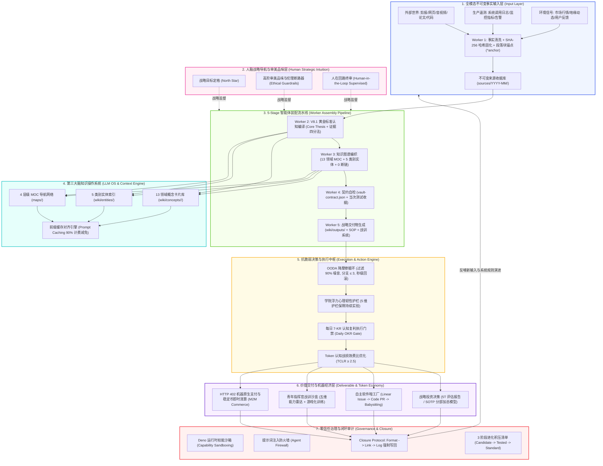

# AI驱动的第三大脑：AI-Native 自主智能体操作系统与认知复利飞轮 (范式跃迁 V8.1)

> **定位：愿景参考（NON-NORMATIVE VISION）。** 本文描述长期目标，不是当前运行时能力清单。当前机器权威是 `contracts/vault-contract.json` 与 `contracts/system-bundle.json`；可执行流水线以 `workflows/worker-flows.md` 为准。尤其是 Worker 5、实体编写、Canvas、自动写回和外部系统集成都不能从本图推断为已自动实现。

> **宿主边界：** 本项目的主机与编排平面是 **Codex OS**（`AGENTS.md`、`~/.agents/skills/`、Codex host tools）；Claude Code、Gemini、Cursor 与 Windsurf 仅是显式兼容适配器，不构成项目操作系统。

> **从知识管理 ➔ 认知增强 ➔ 行为改造 ➔ 创造力放大 ➔ 万亿 Token 机器价值复利**

---

## 一、 范式跃迁演进 (Paradigm Evolution: V1.0 ➔ V8.1.0)

| 阶段 | 核心重点 | 载体与形态 | 运作机制 | 核心跃迁标志 |
| :--- | :--- | :--- | :--- | :--- |
| **A. 旧范式 (V1-V3)** | 知识存储 | 笔记软件 / 本地文件 / 数据库 | 搜索、检索、分类归档 | 静态碎片化，难以产生行动转化 |
| **B. 过渡范式 (V4-V5)** | 知识编译与行为重塑 | LLM Wiki + 行为清单 + MOC 索引 | 人机协同问答、习惯设计、SOP | 从“知道”走向“做到”，可积累可链接 |
| **C. 新范式 (V6-V7)** | 结构化认知与抗脆弱决策 | 领域概念卡片 + OODA 降摩擦 + 抗脆弱模型 | 4 大认知编译问题、Closure Protocol | 决策分支收敛，建立知识复利意识 |
| **D. 终局范式 (V8.1)** | **AI-Native 自进化智能体操作系统** | **Karpathy LLM OS + 5-Stage Worker 暗工厂 + Token 金融** | **前缀缓存对齐、TCLR 战损比中枢、Viking 拓扑自适应** | **0 断链、测试强校验、全天候无熄灯自主进化与价值复利** |

---

## 二、 V8.1 系统全景主架构 (Input ➔ 5-Stage Pipeline ➔ Graph ➔ Output)

---

## 三、 Viking 四大自适应认知拓扑机制 (Viking Adaptive Mindmaps)

| 拓扑类型 | 核心应用领域 | Mermaid 结构 | 配色逻辑 |
| :--- | :--- | :--- | :--- |
| **Type A: 工程因果流 (Pipeline)** | 系统架构、算法流程、暗工厂、上下文工程 | 3 阶段线性推演流水线 `输入 ➔ 编译 ➔ 交付` | 蓝 `#f0f5ff` ➔ 绿 `#f6ffed` ➔ 黄 `#fffbe6` |
| **Type B: 商业飞轮 (Flywheel)** | 投资策略、估值模型、Token 经济、另类资产 | 正向增强反馈流 `资本 ➔ 规模 ➔ 护城河 ➔ 收益 ➔ 资本` | 蓝 `#f0f5ff` ➔ 绿 `#f6ffed` ➔ 红 `#fff1f0` ➔ 紫 `#f9f0ff` |
| **Type C: 决策状态机 (State Machine)** | 行为经济学、抗脆弱、心理韧性、OODA 博弈 | 红蓝对抗与状态转移树 `红警报 ➔ 蓝锚定 ➔ 绿行动 ➔ 黄写回` | 触发 `#fff1f0` 红 ➔ 锚定 `#f0f5ff` 蓝 ➔ 行动 `#f6ffed` 绿 |
| **Type D: 生态结构洞 (Network)** | 网络社会学、社群动力学、跨界中介、开源治理 | 异质子网桥接图 `子网A ➔ 结构洞转译中介 ➔ 子网B ➔ 涌现` | 孤岛 `#fff1f0` ➔ 中介 `#f0f5ff` ➔ 重组 `#f6ffed` |

---

## 四、 系统核心运行原则与目标

1. **人脑是战略舵手，而非语法苦力**：人的核心价值在于目标定格、审美品味、价值观裁决与高阶伦理断路；例行编译与代码实现交由暗工厂。
2. **事实不可变，概念可进化**：`sources/` 原始收据一经写入绝对只读不可篡改；`wiki/concepts/` 概念卡片随新事实的涌现持续迭代。
3. **无契约不入库，无测试不上线**：全库严格受 `vault-contract.json` 约束，任何修改必须经过声明的单元测试套件与断链扫描，并记录当次测试数量和退出码。
4. **低摩擦大于高频动作**：限制 90% 观测噪音，控制决策分支 $\le 3$，以极高 TCLR 战损比实现认知高保真跃迁。
5. **每一次执行必须闭环写回**：凡有行动必有结果，凡有结果必执行 Closure Protocol（`Format -> Link -> Log`），永不发生学习泄露。

**🎯 终极目标**：
让知识不仅被保存，而是被**机器化编译、自适应执行、工业化创造、万亿 Token 价值复利**！
`Input ➔ 5-Stage Assembly ➔ Knowledge Graph ➔ Action/OODA ➔ Deliverables ➔ Automated Write-Back`
