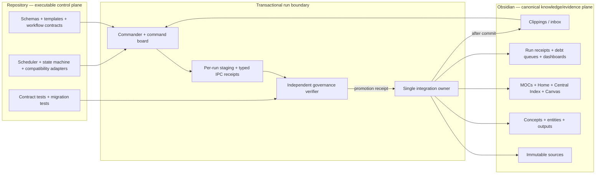

# Third Brain V8.1 Current-Model × Obsidian Blueprint

> **Decision:** keep the repository as the executable control plane, keep Obsidian Markdown as the canonical knowledge and evidence plane, and connect them through a transactional worker runtime. Use a serial command spine with bounded fan-out only for disjoint artifacts. No live-vault mutation is authorized by this blueprint.

## 1. Objective and boundaries

### Objective

Evolve the current V8 scaffold into a resumable, evidence-bound pipeline that can safely ingest new material, retrofit previously imported concept pages to the Gold Standard, weave the Obsidian graph, and produce verifiable outputs at the scale of the current vault.

The target lifecycle is:

`discover -> stage -> compile -> graph-plan -> independently verify -> commit -> archive -> optionally deliver`

### Non-goals

- Do not bulk-rewrite all existing notes.
- Do not mutate immutable source evidence to repair metadata debt.
- Do not let parallel workers write `Home.md`, `中央索引.md`, shared MOCs, dashboards, or logs directly.
- Do not fabricate URL, author, date, source anchors, evidence, metrics, or counterarguments.
- Do not treat a successful process exit, file count, or placeholder artifact as semantic success.
- Do not bind the design to one fixed model name. Route work by capability and verify its artifacts.
- Do not archive a clipping before the committed artifacts pass their required gates.

## 2. Evidence-based starting point

The blueprint is based on a read-only inspection of the repository and the live vault on 2026-08-16.

| Surface | Observed state | Architectural consequence |
|---|---|---|
| Vault scale | 1,231 sources, 1,669 concepts, 707 entities, 74 outputs, and 39 map files | Whole-vault rewrites are too risky; use touched-set gates and bounded migration batches. |
| Version contract | `AGENTS.md` and `GEMINI.md` describe V8.0; `README.md`, `CLAUDE.md`, `system/config.md`, and `system/schema.md` still describe V7/V7.2 | Introduce one machine-readable contract version and publish it to both planes. |
| Template authority | The repo and live-vault `template-concept-gold-standard.md` have different SHA-256 hashes and materially different fields | Reconcile them into one V8.1 schema/template package; never copy in either direction without a version/hash check. |
| Current engine | The five-stage engine can emit files, but GraphWeaver returns `Pending Manual Review` as `SUCCESS`, Governance reports counts without validating links/YAML/block refs, and Deliverable always emits a generic output | Treat the engine as a scaffold, not a production verifier. Split deterministic execution, semantic authoring, integration, and verification. |
| Current tests | Five worker-flow tests pass, including the placeholder GraphWeaver/Governance behavior | Replace artifact-existence tests with contract, failure, idempotency, provenance, and recovery tests. |
| Live governance | The latest scan reports 54 broken source refs, 1,125 source-provenance debt items, 7,759 unresolved wikilinks, and 2,792 notes missing V5 fields | A full-vault-green gate would deadlock ingestion. Require zero new P0/P1 defects in touched files and no regression against the recorded global baseline. |
| Dashboard behavior | Repeated `Daily Knowledge Loop Snapshot` sections coexist, while the headline still claims a 94.5%+ integrity score | Dashboards must be generated from immutable run receipts into one keyed machine-owned block. |
| Writer topology | Python ingest, multi-agent, adaptation, auto-heal, KPI, and PowerShell queue scripts can all touch vault state | Establish one commit owner, explicit writer leases, and compatibility adapters for legacy entry points. |
| Path resolution | Multiple scripts default to a personal absolute vault path | Resolve `--vault` first, then environment/config, and fail closed if the vault fingerprint is ambiguous. |

## 3. System boundary and sources of truth



| Object | Canonical owner | Rule |
|---|---|---|
| Skill contracts, note schemas, templates, workflow definitions, runtime, migrations, and tests | Repository | Changes are reviewed and versioned here first. |
| Source evidence, compiled knowledge, entities, maps, outputs, and decisions | Obsidian vault | Markdown remains the durable canonical store. |
| Generated SOP mirrors in `wiki/sops/` | Repository-derived, vault-resident | Carry `generated_from`, `contract_version`, and `source_hash`; local commentary belongs in a separate overlay block/file. |
| Run state and evidence receipts | `system/runs/YYYY-MM/<run_id>/` in the vault | Append-only receipts; staging is disposable only after a verified commit. |
| Dashboards and indexes | Derived views | Rebuildable from canonical files and run receipts; never the sole evidence source. |

### Contract publication rule

Every generated artifact records at least:

```yaml
contract_version: "8.1.0"
template_id: "concept-gold-standard"
template_version: "8.1.0"
run_id: "run-..."
source_id: "src-..."
source_hash: "sha256:..."
```

The repository and deployed vault template must have the same declared version and content hash before a write-capable run starts.

## 4. Command program and team admission

This design applies the three required command lenses:

| Lens | Concrete implementation |
|---|---|
| Ender / command intent | One commander publishes objective, non-goals, priorities, stop rules, and shared-intent hash. Workers own bounded artifacts, not strategy. |
| Palantir / object-action ontology | Sources, concepts, entities, graph deltas, findings, decisions, and receipts are typed objects; `stage`, `verify`, `commit`, `archive`, and `rollback` are explicit actions. |
| Von Neumann / executable control | A persisted state machine, typed IPC, deterministic tools, checkpoints, verifier, and promotion instruction make the workflow replayable. |

### Team admission decision

- **One clipping:** no five-agent fan-out. One commander runs the serial spine, invokes deterministic tools, uses one semantic author where needed, and requests an independent verification context before commit.
- **Two or more disjoint clippings/concepts:** fan out only per-source and per-concept staging. Default semantic concurrency is 2 and remains configurable.
- **Shared maps, indexes, dashboards, logs, archive state, and final promotion:** always single-writer and serial.
- **Consequential or low-evidence promotion:** add a human approval gate; agent count does not substitute for evidence.

### Command program

```yaml
mission_id: obsidian-v8.1-<run_id>
objective: create evidence-grounded canonical knowledge without provenance or graph regression
non_goals:
  - rewrite_unselected_notes
  - fabricate_missing_evidence
  - parallel_write_shared_artifacts
commander: run-coordinator
integration_owner: vault-commit-owner
independent_verifier: governance-checker
shared_intent_hash: sha256(normalized mission + contract versions + permissions)
checkpoint_path: system/runs/YYYY-MM/<run_id>/state.json
command_board_path: system/runs/YYYY-MM/<run_id>/command-board.md
artifact_manifest_path: system/runs/YYYY-MM/<run_id>/manifest.json
max_attempts_per_failure_signature: 2
promotion_rule: all required receipts green + preimage hashes unchanged
stop_states:
  - NEEDS_INPUT
  - INSUFFICIENT_EVIDENCE
  - BLOCKED_DEPENDENCY
  - BLOCKED_PERMISSION
  - VERIFY_FAILED
  - NO_PROGRESS
  - BUDGET_STOP
```

## 5. Current-model execution strategy

The current model should be used where semantic judgment creates value; exactness belongs to deterministic tools.

| Capability profile | Responsibilities | Must not own |
|---|---|---|
| `deterministic-runtime` | Scan, normalize paths, hash, parse explicit metadata, detect identity, render templates, validate schemas/links/anchors, compare preimages, commit, archive | Unsupported semantic claims or topic synthesis |
| `reasoning-author` | Reconstruct thesis, mechanisms, boundaries, falsifiers, comparison dimensions, implications, timeline, and meaningful links from supplied evidence | Direct writes to shared maps or archive state |
| `graph-planner` | Produce a typed graph delta from existing neighbors and domain maps | Applying shared-file changes |
| `independent-checker` | Verify provenance, claim-to-anchor support, understanding, no placeholders, graph delta, and exact post-write state using a fresh context manifest | Editing the authored artifact during the same check |
| `human-approver` | Resolve ambiguous merges, high-impact rule promotion, source deletion, or consequential publication | Routine deterministic validation |

The model receives a compact `context_manifest`, not the whole vault or a prior worker chat transcript. The manifest contains only the contract version, source identity/hash, selected evidence blocks, candidate target, relevant neighbors/MOCs, allowed paths, known baseline debt, budget, and stop rules.

## 6. Five worker contracts plus control roles

### Control roles

- **Commander:** owns intent, task graph, leases, context manifests, budget, and recovery decisions.
- **Integration Owner:** is the only process allowed to promote staged files and mutate shared artifacts.
- **Independent Verifier:** evaluates staged artifacts and post-commit state; it cannot silently repair the author’s work.

### Worker assembly

| Stage | Exclusive territory | Inputs | Required artifact/receipt | Promotion gate |
|---|---|---|---|---|
| W1 Ingest | One clipping and one staged source candidate | Raw clipping, vault fingerprint, source identity rules | Immutable full source candidate, normalized metadata with explicit unknowns, SHA-256, 3–7 stable anchors, duplicate decision | Exact identity checked before staging and again before commit; no source truncation |
| W2 Cognitive | One staged concept/entity delta | Source anchors, canonical template, relevant existing notes | Gold-Standard concept/entity candidate with thesis, causal mechanism, evidence boundary, falsifier, adaptable Mermaid, paradigm matrix, key data, implications, links, and timeline | Every factual claim has a resolvable locator; no unresolved template tokens |
| W3 GraphWeaver | One graph-delta plan | Candidate note, neighbor query, domain MOC slice | Typed add/remove edge plan plus expected preimage hashes for MOC/Home/Central Index/Canvas | No direct shared-file write; at least two meaningful links or an explicit isolation reason |
| W4 Governance | Read-only touched set and staged deltas | All stage receipts, schemas, preimages, baseline debt | Deterministic lint receipt, semantic understanding decision, regression delta, commit/deny decision | All P0/P1 touched-set checks green; global debt does not worsen |
| W5 Deliverable | One optional output candidate | Verified concepts plus an explicit output trigger | Decision memo, evaluation, compilation, or daily-loop artifact with evidence table and owner/action fields | Runs only when requested or when a configured decision/output threshold is met |

W5 is not a mandatory side effect of every clipping. A generic deliverable created only to make a pipeline look complete is a quality failure.

## 7. Typed IPC and durable state

Every worker returns the same envelope:

```json
{
  "task_id": "task-...",
  "run_id": "run-...",
  "state": "DONE",
  "context_manifest": {
    "contract_version": "8.1.0",
    "vault_fingerprint": "sha256:...",
    "allowed_write_paths": ["system/runs/.../staging/..."],
    "budget": {"attempt": 1, "max_attempts": 2}
  },
  "artifact": [{"path": "...", "sha256": "...", "expected_preimage_sha256": null}],
  "artifact_hash": "sha256:manifest-hash",
  "evidence": [{"check": "source-anchor-resolution", "status": "PASS", "receipt": "..."}],
  "decision": {"promotion": "ALLOW"},
  "unknowns": [],
  "dependency": ["task-upstream"],
  "termination_reason": null,
  "next_action": "submit_to_governance"
}
```

### State transition

`DISCOVERED -> CLAIMED -> STAGED -> AUTHORED -> GRAPH_PLANNED -> VERIFIED -> COMMITTED -> ARCHIVED`

- A failure transitions to one explicit stop state and persists evidence plus `next_action`.
- A retry resumes the failed node; it does not replay completed writes or append duplicate log entries.
- A repeated failure signature after a changed strategy stops at attempt 2.
- `archive` is legal only after `COMMITTED` and successful post-commit verification.
- A transient failure leaves the clipping in place. A terminal failure may invoke the existing `fail` queue action only after its failure receipt is persisted.

## 8. Transaction and write protocol

1. **Preflight:** resolve and fingerprint the vault; load contract/template hashes; record permissions and the global debt baseline.
2. **Discover:** scan queue without mutation; create source identities and an idempotency key from operation, canonical source identity, target, and run/batch.
3. **Stage:** workers write candidates only under `system/runs/<run_id>/staging/`.
4. **Plan:** produce concept/entity and graph deltas with expected target preimage hashes.
5. **Verify:** W4 checks schema, links, block refs, source immutability, placeholders, understanding, taxonomy, and no-regression rules.
6. **Commit serially:** Integration Owner rechecks identity and preimages, promotes canonical files, applies graph deltas in dependency order, and appends one idempotent receipt.
7. **Verify post-commit:** read touched files from disk and repeat the cheapest direct checks against final paths.
8. **Archive:** invoke the clipping archive adapter only after the commit receipt is green.
9. **Close:** persist the final manifest, update one keyed dashboard block, remove disposable staging, release leases, and record a short after-action review.

Rollback may remove or restore derived concept/map writes from the transaction manifest, but it must not erase original source evidence or append-only receipts.

## 9. Canonical concept template and retrofit lane

### V8.1 template decision

Neither current template should be copied wholesale over the other. The V8.1 canonical template should merge:

- the live vault template’s flexible Mermaid topology selection, richer mechanism decomposition, URL/author/date fields, and five-dimension comparison matrix;
- the repo template’s explicit evidence level, knowledge stage, evidence boundary, falsifier, exact locators, actionable implications, governance constraint, and claim-level source anchors.

One schema should validate the data model; Markdown templates should be renderers of that schema. The live template named by the user is the structural/visual baseline for retrofits, with the stronger provenance gates restored before migration begins.

### Previously imported concept retrofit

Run retrofits as a separate migration lane so they cannot block live clipping ingestion.

1. Build an immutable candidate manifest using import markers, source backlinks, template version, unresolved placeholders, or missing Gold-Standard sections.
2. Partition candidates by domain/MOC and source availability.
3. Classify each page:
   - `STRUCTURE_ONLY`: content is supported; normalize fields/sections without changing claims.
   - `EVIDENCE_RESTORABLE`: source exists; the reasoning author may rebuild semantic sections from resolvable anchors.
   - `INSUFFICIENT_EVIDENCE`: preserve the page, mark the debt, and do not invent missing content.
4. Generate a page-level before/after diff, source-anchor ledger, graph delta, and rollback entry.
5. Verify every changed claim and locator, then commit one bounded domain batch at a time.
6. Re-run touched-set lint and compare global health counts after each batch.

The first retrofit canary should be a small, representative set from one domain, including one clean page, one broken-source page, and one duplicate/title-collision case.

## 10. Governance and quality gates

### Required touched-set gates

- Vault identity, contract version, and template hash match the run manifest.
- Source identity is unique at commit time; reruns converge to one canonical source and one logical receipt.
- Immutable source content equals its recorded SHA-256 after commit.
- Every required block locator exists and every derived claim resolves to an allowed source locator.
- Required YAML fields pass the note-type schema.
- No `{{...}}`, placeholder prose, generic metrics, or `Pending Manual Review` is accepted as success.
- New wikilinks resolve, or the artifact records an explicit reviewed isolation/debt decision.
- Concept pages pass the understanding gate: thesis, mechanism, boundary, falsifier/counterpoint, and reusable implication.
- Shared artifacts were changed only by the Integration Owner and their preimage hashes matched.
- Post-commit file hashes and archive state match the final manifest.

### Global migration gate

Legacy debt is tracked separately from new defects:

- touched files: zero new P0/P1 findings;
- whole vault: no increase in broken source refs, unresolved links, missing required fields, or duplicate machine-owned dashboard blocks;
- debt reduction claims: only from fresh full or explicitly scoped scans with paths, exclusions, and counts.

### Dashboard rule

Replace repeated appended snapshots with one marker-bounded block per dashboard producer, keyed by producer and snapshot type. History lives in run receipts, not duplicated dashboard sections.

## 11. Target project layout

```text
contracts/
  vault-contract.yaml
  ipc/worker-receipt.schema.json
  notes/source.schema.json
  notes/concept.schema.json
  notes/entity.schema.json
  notes/output.schema.json
workflows/
  obsidian-worker-flow-v8.1.yaml
tools/
  worker_flow/
    cli.py
    engine.py
    state.py
    transactions.py
    stages/
    validators/
  worker_flow_engine.py              # compatibility facade during migration
tests/
  contracts/
  integration/
  migration/
system/templates/
  template-source-v8.1.md
  template-concept-gold-standard-v8.1.md
  template-output-deliverable-v8.1.md
```

Vault runtime state:

```text
system/runs/YYYY-MM/<run_id>/
  command-board.md
  state.json
  manifest.json
  receipts/
  staging/
  rollback.json
```

### Legacy entry-point disposition

| Current entry point | V8.1 role |
|---|---|
| `tools/worker_flow_engine.py` | Compatibility CLI that delegates to the new runtime until callers migrate |
| `tools/run_30min_clippings_pipeline.py` | Deprecated authoring path; retain only as a queue/runtime adapter during transition |
| `tools/multi_agent_vault_team.py` | Replace with the command board and bounded worker topology |
| `tools/adapt_skills_to_vault.py` | Convert to dry-run-first, hash-aware SOP publisher; no unconditional overwrite/log append |
| `system/scripts/run-clippings-pipeline.ps1` | Keep as a minimal scan/archive/fail queue adapter; it does not decide semantic success |
| KPI/flywheel scripts | Read-only scanners plus marker-bounded derived-view updates |

## 12. Migration sequence

| Phase | Change | Exit evidence |
|---|---|---|
| 0. Blueprint approval | Freeze implementation and agree authority, template, rollout, and failure boundaries | Approved architecture decision record |
| 1. Contract unification | Reconcile V7.2/V8 labels, merge the canonical concept schema/template, add hashes and vault fingerprint | Repo/vault contract parity test |
| 2. Runtime kernel | Add persisted state, command board, typed IPC, dry-run, leases, idempotency, and transaction manifests | Resume/replay and no-op tests |
| 3. Safe ingest | Implement full-source preservation, identity dedupe, anchors, staged commit, and post-commit archive | Fresh/duplicate/race/failure integration tests |
| 4. Cognitive + graph | Replace generic authoring with evidence-bounded semantic compilation; emit graph deltas; serialize shared integration | Claim-anchor and shared-writer tests |
| 5. Real governance | Implement all deterministic touched-set checks, semantic understanding review, and no-regression baseline | Intentional defect tests fail with correct status |
| 6. Retrofit canary | Upgrade a small manifest of previously imported pages using the live template baseline plus V8.1 provenance gates | Page diffs, rollback test, zero new P0/P1 defects |
| 7. Controlled rollout | Expand by domain batch; keep shadow mode and legacy compatibility adapters until two clean cycles | Batch receipts and after-action reviews |
| 8. Consolidation | Retire duplicate orchestrators, align docs, publish SOP mirrors, and remove stale compatibility paths | Entry-point inventory and full contract suite |

## 13. Acceptance test matrix

The implementation is not production-ready until these cases pass:

1. Fresh clipping with complete metadata creates one immutable source and one supported concept.
2. The same clipping rerun is a verified no-op and does not append a duplicate receipt.
3. Two workers racing on the same canonical URL converge to one source.
4. Missing author/date remains explicitly unknown; no field is fabricated.
5. A broken source anchor blocks promotion and leaves the clipping unarchived.
6. A concept containing an unresolved template token fails Governance.
7. A changed MOC preimage blocks the graph commit and preserves both candidate and recovery state.
8. A mid-run restart resumes from the last verified node without replaying completed writes.
9. A Governance failure can roll back derived writes without deleting source evidence or receipts.
10. Existing whole-vault debt does not block a clean touched set, but any regression does.
11. Retrofit of an evidence-poor concept returns `INSUFFICIENT_EVIDENCE` rather than synthetic Gold-Standard prose.
12. Dashboard refresh produces one current machine-owned snapshot and preserves historical receipts elsewhere.
13. W5 does not run without an explicit output trigger.
14. `--audit` reports actual YAML/link/block/source findings, scope, exit status, and reproducible paths.

## 14. Recommended approval package

Approve these defaults before implementation:

1. **Architecture:** repository control plane + Obsidian canonical data plane + transactional runtime bridge.
2. **Authority:** one merged V8.1 schema/template published with matching hashes; the live Gold-Standard template is the retrofit baseline, not an unversioned overwrite source.
3. **Topology:** serial spine, semantic fan-out capped at 2 by default, one Integration Owner, independent Governance.
4. **Rollout:** dry-run -> shadow -> one-domain retrofit canary -> bounded domain batches.
5. **Safety:** archive only after post-commit verification; no fabricated provenance; touched-set zero-regression gate.

After approval, Phase 1 should begin with contract/template reconciliation and acceptance-test scaffolding. Live-vault content migration should not begin until Phases 1–5 are green in an isolated test vault.

## 15. Temporal and live-vault rollout amendment

The vault owner subsequently expanded the rollout to include `maps/`, `sources/`, `system/`, and `wiki/`. This does not weaken the transaction boundary:

- time-sensitive claims carry `freshness_tier`, `valid_as_of`, `last_verified`, `next_review`, and `freshness_status`;
- the same URL with changed content creates a new immutable snapshot linked to prior snapshots;
- existing source bodies are never mechanically upgraded in place;
- live rollout begins with a read-only inventory, then a system-contract deployment, one new project source/concept, and one evidence-restorable concept retrofit;
- map changes remain marker-bounded and single-writer;
- domain batches advance only when touched-set P0/P1 findings stay at zero and whole-vault debt does not regress.

The verified baseline and selected canary are recorded in `docs/live-vault-v8.1-baseline-2026-08-16.md`.
