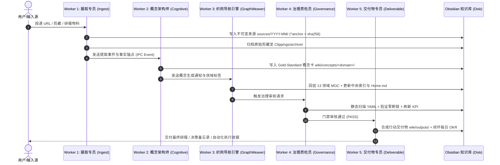

# Obsidian Wiki 多智能体 Worker 流水线实操手册 (OCD V8.0)

> **核心设计哲学**：知识库不是散乱对话的垃圾场，而是具备严密编译流水线、明确 Worker 分工、100% 事实回溯与最终行动交付的**“个人与团队认知操作系统 (Cognitive Operating System)”**。

---

## 📖 目录
1. [系统演进背景与 OCD V8.0 核心突破](#一系统演进背景与-ocd-v80-核心突破)
2. [5 阶段流水线标准分工 (Worker Roles)](#二5-阶段流水线标准分工-worker-roles)
3. [从物料输入到战略交付的端到端案例](#三从物料输入到战略交付的端到端案例)
4. [本地 Python 与 PowerShell 执行工具箱](#四本地-python-与-powershell-执行工具箱)
5. [常见阻塞排查与防呆门禁 (Quality Gates)](#五常见阻塞排查与防呆门禁-quality-gates)

---

## 一、系统演进背景与 OCD V8.0 核心突破

在传统的 AI 笔记或 Agent 工作流中，系统常面临两大死穴：
1. **“AI速度病 (Velocity Sickness)”**：Agent 快速生成大量孤立无连接的文本，上下文迅速崩溃，导致“只有输出、没有影响力 (Output without impact)”。
2. **“事实幻觉与证据断链”**：提取的概念缺乏原始出处，无法辨别单源假设与独立实证。

### 🌟 OCD V8.0 核心升级：
- **流水线化装配 (Worker Assembly Pipeline)**：解耦摄取、编译、织网、质检与交付 5 个独立工种。
- **100% 事实锚定与不可变来源**：所有来源生成唯一的 SHA-256 指纹，核心观点打上 `^anchor` 块引用。
- **Gold-Standard 概念卡标配**：必须包含 Core Thesis Callout、Mermaid 机制流图、四维范式对比矩阵与反证条件。
- **严格的双向织网与可视化**：概念卡强制双向连接至 13 领域 MOC、Home.md、中央索引与 `.canvas` 白板。
- **终局交付导向**：知识沉淀的终点是驱动行动决策，直接输出至 `wiki/outputs/` 与 `wiki/decisions/`。

---

## 二、5 阶段流水线标准分工 (Worker Roles)



---

## 三、从物料输入到战略交付的端到端案例

以摄取**《Browserbase: Bringing Agents onto the World Wide Web》**为例：

### 步骤 1：Worker 1 摄取与事实锚定
- 输入：`Clippings/Bringing Agents onto the World Wide Web.md`
- 产出：`sources/2026-08/2026-08-14-bringing-agents-onto-the-world-wide-web-paul-klein-browserbase.md`
- 锚点：`^cloud-browser-infra`、`^soc2-isolation-sandbox`

### 步骤 2：Worker 2 认知编译
- 产出：`wiki/concepts/ai-engineering/无头浏览器云基础设施与智能体隔离环境.md`
- 机制：
  ```mermaid
  flowchart LR
      A[本地 Mac mini 脆弱性] --> B[SOC-2 云端隔离沙箱]
      B --> C[瞬时浏览器集群] --> D[高并发抗反爬会话]
  ```
- 矩阵：本地单机脚本 vs 云端弹性 BaaS 基础设施对比。

### 步骤 3：Worker 3 图谱织网
- 挂载至 `maps/domain-mocs/AI 知识工作流.md` 中的 `## 2026-08-15 Web 自动化与计算机使用专题`。
- 回写至 `maps/Home.md` 与 `maps/中央索引.md`。

### 步骤 4：Worker 4 治理审计
- 运行 `python tools/worker_flow_engine.py --audit`，确认无 YAML 报错、无损坏链接。

### 步骤 5：Worker 5 产出战略交付
- 产出 `wiki/outputs/evaluations/2026-08-15-智能体云端无头浏览器基础设施选型与部署备忘录.md`。
- 给出清晰的采购决策建议与 ROI 测算。

---

## 四、本地 Python 与 PowerShell 执行工具箱

### 1. 启动多智能体全流水线编排
```bash
# 运行 5-Stage Worker 流水线
python tools/worker_flow_engine.py --vault "C:\Users\高杰\Documents\Obsidian Vault"
```

### 2. 运行治理健康检查
```bash
python tools/worker_flow_engine.py --audit
```

### 3. 运行完整单元测试套件
```bash
python -m unittest discover -s tools -p "test_*.py"
```

---

## 五、常见阻塞排查与防呆门禁 (Quality Gates)

| 异常现象 | 根因定位 | 标准解法 |
| :--- | :--- | :--- |
| **YAML Frontmatter 报错** | 中文标点、缺失单引号或冒号后无空格 | 运行 `tools/auto_heal_vault.py` 自动规范化修复 |
| **断链 (Broken Links)** | 引用的概念卡或来源文件名变更未同步重命名 | 使用 `tools/adapt_skills_to_vault.py` 重新对齐相对路径 |
| **收件箱队列未清零** | 剪藏已生成来源但未物理移动到 `archive/` | 运行 `Worker-Ingest` 的归档函数移动原始物料 |
| **概念缺乏实证支撑** | 未打精确块引用（`^anchor`） | 打开来源卡补充 `^anchor` 并修改概念卡精准链接 |
