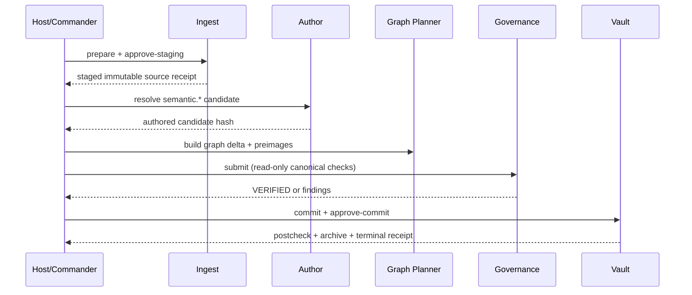

# Obsidian V8.1 事务式 Worker 流水线实操手册

V8.1 的核心不是“自动生成更多笔记”，而是让每次写入都经过可审计的候选、治理、串行提交与回滚边界。

## 一、唯一运行入口

```powershell
$repoRoot = "<third-brain-repository>"
$vaultRoot = "<explicit-obsidian-vault>"
Set-Location -LiteralPath $repoRoot
python -B -m tools.worker_flow.cli --vault $vaultRoot --repo $repoRoot scan
```

`tools/worker_flow_engine.py`、`run_30min_clippings_pipeline.py`、`multi_agent_vault_team.py`、`auto_heal_vault.py` 与 `adapt_skills_to_vault.py` 均为只读兼容入口，不再执行写入、移动、归档、测试递归或自动修复。

## 二、执行顺序

1. **W1 Stage**：完整保留输入字节、SHA-256、出处和 3–7 个真实块锚点；只写 run staging。
2. **W2 Author**：运行时填充 host 字段，作者仅处理注册的 `semantic.*` 字段；Frontmatter 在作者阶段前就必须通过 Schema。
3. **W3 Graph Plan**：生成 MOC/地图候选差异，并记录共享目标 preimage。
4. **W4 Govern**：检查 Schema、来源 ID、全部链接目标与锚点、歧义链接、时效性和 touched-set 回归。
5. **Serial Commit**：只有 `VERIFIED` 且得到显式提交批准后才能 compare-and-set 写入；随后做 postcheck，最后归档 Clipping。
6. **W5 Deliverable（可选）**：在已提交知识之上单独编写、审核交付物；当前能力是模板与 Schema 支持，不宣称全自动作者。



## 三、系统控制面部署

```powershell
$stage = python -B -m tools.worker_flow.cli --vault $vaultRoot --repo $repoRoot prepare-system --approve-staging | ConvertFrom-Json
python -B -m tools.worker_flow.cli --vault $vaultRoot --repo $repoRoot submit --run-id $stage.run_id
python -B -m tools.worker_flow.cli --vault $vaultRoot --repo $repoRoot commit --run-id $stage.run_id --approve-commit
```

提交前必须保存 bundle hash、目标 preimage，以及 `Clippings/`、`sources/`、`wiki/`、`maps/` 的树哈希。任一变化都要重新规划，不能沿用旧批准。

## 四、验证命令

```powershell
python -B tools/lint-agent-skills.py
python -B -m unittest discover -s tools -p "test_*.py" -v
python -B -m unittest discover -s tests -p "test_*.py" -v
python -B -m unittest discover -s experiments/graph-engineering/tests -p "test_*.py" -v
git diff --check
```

测试数量随仓库演化，以当次输出和退出码为准，不在文档中写死。

## 五、停止条件

- `VERIFY_FAILED`：修复候选后重新 submit；不得绕过。
- `BLOCKED_DEPENDENCY`：目标 preimage 或仓库 bundle 已变化，重新 stage。
- `INSUFFICIENT_EVIDENCE`：证据或锚点不足，保留来源，不生成成功概念。
- `NO_OP`：队列为空或同一 bundle 已验证部署，要求副作用数为 0。
- 任何来源或待处理 Clipping 的批量语义迁移，必须另行审批。
