# Ender-Palantir-Von Neumann Command Patterns & Scaled Swarm Architecture (V8.1)

> **核心使命**：将《安德的游戏》的分级舰队作战艺术、Palantir 的本体对象/操作架构与冯·诺依曼可执行程序体系深度融合，构建支持从 **5 到 100+ 智能体动态弹性伸缩**的高保真、低摩擦多 Agent 指挥中枢。

---

## 1. 强制前置：任务清单与 Token 战损预算门禁 (Pre-Flight Task List & Token Gate)

在启动任何多 Agent 任务前，必须在指挥平面（Command Board）中前置确立 **结构化任务清单 (Task DAG)** 与 **Token 战损预算账本 (Token Attrition Ledger)**：

```markdown
# Command Board & Pre-Flight Task DAG

Mission:
  id: "mission-20260818-scale-upgrade"
  objective: "批量升级全库概念卡片并执行 0 断链全链路验证"
  tier_selected: "tier_3_battlegroup_50_agents"
  time_sla_minutes: 60
  total_token_budget_etc: 450000
  target_tclr: 2.85

Pre-Flight Task List:
  - task_id: "T-01"
    title: "来源事实不可变收据生成与去噪"
    owner_agent: "agent-ingest-squad"
    dependencies: []
    token_budget_etc: 15000
    sla_seconds: 300
    verifier_cmd: "python tools/verify_sources.py"

  - task_id: "T-02"
    title: "13 领域概念卡片 V8.1 黄金标准并行编译"
    owner_agent: "agent-compiler-toon-1..5"
    dependencies: ["T-01"]
    token_budget_etc: 200000
    sla_seconds: 1200
    verifier_cmd: "python -m unittest tests/test_concepts.py"

  - task_id: "T-03"
    title: "中央 MOC 索引编织与 0 断链验证"
    owner_agent: "agent-graph-squad"
    dependencies: ["T-02"]
    token_budget_etc: 35000
    sla_seconds: 600
    verifier_cmd: "python tools/check_broken_links.py"

  - task_id: "T-04"
    title: "全库回归测试与不可变写回收据"
    owner_agent: "agent-integration-gate"
    dependencies: ["T-03"]
    token_budget_etc: 50000
    sla_seconds: 600
    verifier_cmd: "python -m unittest discover -s tests -p 'test_*.py'"
```

---

## 2. 安德四阶弹性编队体系 (Ender's Game Scaling Tiers)

```mermaid
flowchart TD
    subgraph T1 ["Tier 1: 5 Agents (小队 / Squad)"]
        A_Cmd["Squad Commander"] --> A_W1["Worker 1"] & A_W2["Worker 2"]
        A_W1 & A_W2 --> A_Crit["Adversarial Critic"] --> A_Int["Integration Lead"]
    end

    subgraph T2 ["Tier 2: 10 Agents (中队 / Squadron)"]
        B_Cmd["Squadron Lead"] --> B_Toon1["Toon A (4 Agents)"] & B_Toon2["Toon B (4 Agents)"]
        B_Toon1 & B_Toon2 --> B_Gate["Gatekeeper"]
    end

    subgraph T3 ["Tier 3: 50 Agents (军团 / Battle Group)"]
        C_Fleet["Fleet Commander"] --> C_Leads["5 Battle Leads"]
        C_Leads --> C_Exec["25 Execution Workers"]
        C_Exec --> C_Verif["10 Sandbox Verifiers"]
        C_Verif --> C_Ctrl["5 Token Budgeters + 4 Merge Officers"]
    end

    subgraph T4 ["Tier 4: 100+ Agents (舰队群 / Fleet Swarm)"]
        D_Supreme["Supreme Commander"] --> D_Mesh["Distributed Swarm Grid & Token Mesh"]
        D_Mesh --> D_Dark["Dark Software Factory (Continuous Injection Molding)"]
    end

    style T1 fill:#f0f5ff,stroke:#2f54eb,stroke-width:2px
    style T2 fill:#f6ffed,stroke:#52c41a,stroke-width:2px
    style T3 fill:#fffbe6,stroke:#faad14,stroke-width:2px
    style T4 fill:#f9f0ff,stroke:#722ed1,stroke-width:2px
```



### 1. Tier 1: 5-Agent Strike Team (小队级 / Squad)
- **适用场景**：单文件精修、局部 Bug 排查、单篇前沿论文深度研究。
- **角色分配**：1 Commander, 2 Field Workers, 1 Adversarial Critic, 1 Integration/Log Lead.
- **协调机制**：共享单一 Context 前缀，串行终审，Token 消耗极小（$< 25\text{K}$ ETC）。

### 2. Tier 2: 10-Agent Task Squadron (中队级 / Squadron)
- **适用场景**：模块级重构、前后端接口联调、红蓝双盲对抗演练。
- **角色分配**：1 Squadron Lead, 2 Toon Leads (分队长), 4 Functional Workers, 2 Critics, 1 Gatekeeper.
- **协调机制**：Toon Lead 拥有局部自治权，通过结构化 JSON IPC 汇报，集中合并。

### 3. Tier 3: 50-Agent Battle Group (大队 / 军团级 / Battle Group)
- **适用场景**：全库千级卡片批量升级、多系统分布式渗透、全网高并发爬取。
- **角色分配**：1 Fleet Commander, 5 Battle Leads, 25 Execution Workers, 10 Sandbox Verifiers, 5 Token Monitors, 4 Merge Officers.
- **协调机制**：工作树物理隔离（Separate Worktrees）、分布式推测性构建、细粒度 Token 预算硬顶监控。

### 4. Tier 4: 100+ Agent Fleet Swarm (舰队群 / 战区级 / Fleet Swarm)
- **适用场景**：暗软件注塑工厂（7,000+ PRs/周）、全天候无熄灯自主运维。
- **角色分配**：最高司令部（Supreme HQ）➔ 区域指挥官 ➔ 专业集群；全自动化流水线。
- **协调机制**：Prompt Caching 前缀全局共享（$\ge 90\%$ 命中）、HTTP 402 内部 Token 微计费、推测性合并队列（Merge Queue）零冲突推进。

---

## 3. 动态自适应编队算法 (Scope & Time-SLA Adaptive Matrix)

根据任务范围与时效要求动态计算最佳队伍规模与拓扑：

$$\text{Optimal Agents} = \min\left(N_{\text{max}}, \frac{\text{Task Scope Points} \times \text{Complexity Factor}}{\text{Time SLA (Hours)}}\right)$$

| 任务范围 (Scope) | 极速紧急 (SLA < 15min) | 交互敏捷 (SLA 15-60min) | 深度批处理 (SLA 1-4hr) | 全天候持续 (SLA 24/7) |
| :--- | :---: | :---: | :---: | :---: |
| **单文件 / 局部功能** | **Tier 1 (5)** | Tier 1 (5) | Tier 1 (5) | Tier 1 (5) |
| **子系统 / 多模块重构** | Tier 2 (10) | **Tier 2 (10)** | Tier 2 (10) | Tier 2 (10) |
| **跨系统 / 全库知识升级** | Tier 3 (50) | Tier 3 (50) | **Tier 3 (50)** | Tier 3 (50) |
| **企业级暗工厂 / 全网扫描**| Tier 4 (100+) | Tier 4 (100+) | Tier 4 (100+) | **Tier 4 (100+)** |

---

## 4. Token 战损效费比调度 (Token Attrition & TCLR Governance)

- **ETC 计算**：$\text{ETC} = 0.1 \cdot T_{\text{cache}} + 1.0 \cdot T_{\text{in}} + 3.0 \cdot T_{\text{out}}$
- **前缀缓存杠杆**：所有 Agent 在初始化时强制挂载相同的静态 System Prompt、Task List 与 Schema，确保 Input Tokens 触发 90% 计费减免。
- **单节点断路器**：任何 Agent 节点如果消耗超过额定 `token_budget_etc` 且未产生有效收据，立即熔断并转移任务至备用节点。
- **TCLR 定义**：$\text{TCLR}=\text{已验证完成任务数}/(\text{ETC}/10{,}000)$，数值越高越好。
- **目标战损比**：在任务清单中声明基线与最低阈值；只有具备历史数据时才使用具体数字。`2.5` 可作为示例，不是通用门禁。

---

## 5. 闭环协议与清场归档 (Closure & Teardown Protocol)

1. **逐级验证 (Hierarchical Verification)**：每个 Worker 的产出物必须在独立沙箱中通过回归测试。
2. **串行集成 (Serial Integration)**：Merge Officer 按照 DAG 拓扑顺序将产出物逐一合并至主干，杜绝并发语义冲突。
3. **清场释放 (Teardown)**：销毁临时 Agent 进程、释放 Worktree 磁盘空间、清理中间状态文件。
4. **经验写回 (Write-Back)**：执行 Closure Protocol (`Format -> Link -> Log`)，将编队战损数据与复盘经验沉淀至 `system/log.md` 与进化积压库。
