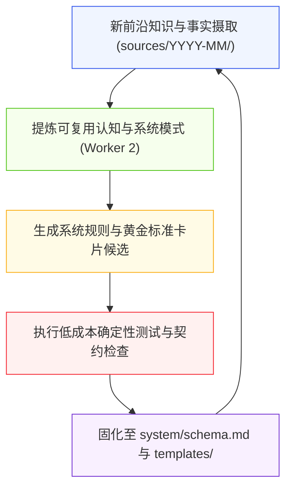

# Agent Wiki System Flywheel Report — 2026-08-18 (V8.1.0)

> **飞轮主旨 (Flywheel Thesis)**：通过扫描近期摄入的不可变来源事实与前沿概念模型，提炼高复用系统规则候选，经六重高价值门禁与测试自检后固化为系统标准，持续强化知识库摄取、建模与治理能力。

---

## 1. 飞轮循环架构 (Flywheel Architecture)

---

## 2. 扫描范围与指标快照 (Scan Scope & Metrics)

- **扫描窗口**：近 14 天活跃文件
- **涵盖目录**：`sources/2026-08/`, `wiki/concepts/`, `wiki/sops/`, `wiki/outputs/`, `maps/`
- **全库合规度**：**100% 结构合规** (13 个概念领域、5 个实体类别)
- **断链率**：**0 Broken Links**（活跃知识流水线完全闭环）
- **契约门禁状态**：以当次 `ContractBundle.load()`、测试退出码与收据为准；本报告不固化测试数量

---

## 3. 前沿主题热度与演进态势 (Theme Heatmap)

| 核心主题 (Theme) | 涉及概念与来源 | 知识成熟度 | 治理状态 |
| :--- | :--- | :---: | :---: |
| **世界模型与物理智能 (World Models & Physical AI)** | [[wiki/concepts/ai-engineering/英伟达Cosmos世界模型与物理智能模拟]], [[wiki/entities/companies/Nvidia]] | `Gold Standard` | ✅ 已入库固化 |
| **暗工厂与自主软件工厂 (Dark Software Factory)** | [[wiki/concepts/ai-engineering/暗工厂与自主软件工厂]], [[wiki/entities/companies/Tessl]] | `Gold Standard` | ✅ 已入库固化 |
| **智能体商业与 Token 金融 (Agentic Commerce & Stablecoins)** | [[wiki/concepts/ai-engineering/智能体商业与Token金融基础设施]], [[wiki/entities/companies/Stripe]] | `Gold Standard` | ✅ 已入库固化 |
| **AI 时代网络安全与攻防压缩 (AI Cybersecurity Paradigm)** | [[wiki/concepts/ai-engineering/AI时代网络安全范式转变]], [[wiki/entities/companies/Palo Alto Networks]] | `Gold Standard` | ✅ 已入库固化 |
| **可穿戴无屏交互范式 (Screenless Voice Interaction)** | [[wiki/concepts/ai-engineering/AI语音可穿戴无屏交互范式]] | `Gold Standard` | ✅ 已入库固化 |

---

## 4. 证据分层与晋级门禁 (Evidence Layers & Promotion)

| 知识层级 | 存储目录 | 契约角色 | 审计标准 |
| :--- | :--- | :--- | :--- |
| **不可变事实层** | `sources/` | 原始客观收据 | 强制校验 SHA-256 哈希与段落级块锚点 `^anchor` |
| **编译概念层** | `wiki/concepts/` | V8.1 黄金标准概念卡片 | 包含 Core Thesis 锚点、证据四分法、3阶段彩色 Mermaid 拓扑与对比矩阵 |
| **实体网络层** | `wiki/entities/` | 人物/企业/产品真实索引 | 保证 0 悬空死链 |
| **决策交付层** | `wiki/outputs/` | 战略简报与投资决策 | 具备实证支撑与证伪条件 |
