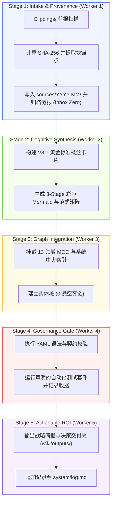

# Third Brain V8.1 — 自动化更新与治理闭环 (Auto-Update Loop)

> **核心目标**：将新摄入的知识转化为可追溯、可验证的系统演进资产。通过不可变事实分层、黄金标准契约门禁、自动化健康审计与人工裁决，实现知识库与操作系统的持续复利进化。

---

## 1. 5-Stage 事务性执行流水线 (Worker Flow Loop)

---

## 2. 治理分层与证据有效性原则 (Governance Layers)

| 知识层级 | 目录路径 | 契约角色 | 是否可作为独立晋级证据 |
| :--- | :--- | :--- | :---: |
| **不可变事实层** | `sources/` | 原始客观收据（带 SHA-256 与 `^anchor`） | ✅ 候选事实支撑 |
| **概念模型层** | `wiki/concepts/` | V8.1 黄金标准概念卡片（带 Core Thesis） | ✅ 编译后知识 |
| **实体索引层** | `wiki/entities/` | 人物、企业、基金、产品、组织真实索引 | ✅ 关联锚点 |
| **交付成果层** | `wiki/outputs/` | 高确定性决策简报与评估研报 | ✅ 本地验证凭证 |
| **导航索引层** | `maps/` | 领域 MOC、索引与可视化白板 | ❌ 仅供导航（不作独立证据） |

---

## 3. 高价值晋级门禁 (High-Value Promotion Gate)

任何系统规则或核心架构的演进晋级必须满足以下六大条件：
1. **重复需求 (Repeated Demand)**：在多个独立场景或来源中反复出现。
2. **事实锚定 (Source Grounding)**：具备确切的 `sources/` 块锚点支持。
3. **有界操作 (Bounded Action)**：可形式化为明确的原子操作或 SOP。
4. **系统杠杆 (System Leverage)**：显著降低认知摩擦或提升执行确定性。
5. **低成本自检 (Cheap Verification)**：具备自动化测试或快速审计检查点。
6. **边界与回退 (Budget & Rollback)**：具备清晰的停止条件与失败回滚路径。
