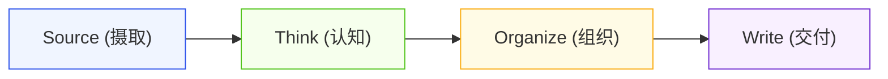

# Third Brain V8.1 — 知识闭环与认知编译 (Knowledge Loop)

> **知识复利核心定律**：输入不等于掌握，存储不等于理解。只有经过**不可变事实锚定**、**第一性原理机制建模**、**图谱双向编织**与**高确定性行动转化**，知识才能转化为持续增长的个人 AGI 资产。

---

## 1. 核心链路与架构映射

```
[外部输入] ──> [Worker 1: 摄取与事实锚定] ──> [Worker 2: 认知编译与建模] ──> [Worker 3: 图谱编织与索引] ──> [Worker 4: 治理质检] ──> [Worker 5: 交付物转化]
```

### Karpathy LLM OS 认知映射
- **LLM = CPU** (即时推理、代码生成与多模态提炼)
- **Context = RAM** (动态工作上下文与提示词工程)
- **Obsidian Vault = Disk** (持久化事实底座与知识图谱)
- **Tools = System Calls** (文件读写、网络检索与终端执行)
- **Skills = Programs** (`third-brain-v5-skills` 模块化程序)
- **Harness = Kernel** (调度中枢、权限控制与事务保护)
- **Agent Teams = Processes** (多智能体流水线并发作业)

---

## 2. 认知编译四要素 (Cognitive Compilation Core)

在处理高价值事实并构建概念卡片时，必须显式回答以下四个核心问题：

1. **模式识别 (Pattern Recognition)**：该现象对应底层哪些跨学科的普适物理、经济或计算模型？
2. **冲突检测 (Conflict Detection)**：该新事实与现有认知框架或旧基准的冲突边界在哪里？
3. **假设生成 (Hypothesis Generation)**：基于此机制，能够提出哪些具备可证伪性的前瞻预测？
4. **决策支撑 (Decision Support)**：该概念如何直接指导架构选择、商业投资或行为落地？

---

## 3. STOW 管道与 V8.1 标准产物



- **Source (摄取)**：`sources/YYYY-MM/` 不可变事实收据（SHA-256 + `^anchor`）。
- **Think (认知)**：`wiki/concepts/<domain>/` V8.1 黄金标准概念卡片。
- **Organize (组织)**：`maps/domain-mocs/` 领域 MOC 与 `wiki/entities/` 实体网络。
- **Write (交付)**：`wiki/outputs/` 战略简报与投资决策备忘录。

---

## 4. 闭环协议 (Closure Protocol)

每次会话或产出结束时，必须执行闭环三部曲：
1. **Format (规范化)**：将临时草稿按 V8.1 黄金标准格式沉淀为 Markdown 卡片。
2. **Link (双向链接)**：挂载至领域 MOC 与相关概念/实体，杜绝孤岛。
3. **Log (审计日志)**：在 `system/log.md` 记录变更摘要与证据收据。
