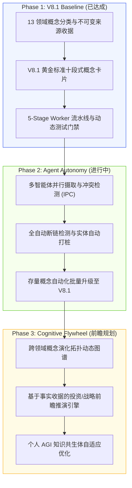

# Third Brain V8.1 — 系统演进与规则积压待办 (Evolution Backlog)

> 本待办台账记录第三大脑在 **个人 AGI 与知识操作系统** 方向的核心演进路线、架构规则候选与前瞻研究主题。

---

## 1. 核心架构演进路线 (Architecture Roadmap)

---

## 2. 结构化系统规则候选 (Candidate Rules)

### 1. [agent-loop] Loop Engineering & 硬预算控制
- **候选规则**：所有重复性智能体任务必须显式声明 `Trigger -> Execute -> Verify -> State`，并附带硬 Token/步数预算、停止条件与回滚路径。
- **状态**：`APPROVED`（已在 `third-brain-v5-skills` 全面落地）。

### 2. [harness-boundary] 权限与工具沙箱边界
- **候选规则**：智能体执行外部工具调用或写回系统状态时，必须具备严格的权限边界、不可变审计记录与失败补偿机制。
- **状态**：`APPROVED`。

### 3. [gold-standard-contract] V8.1 概念卡片强类型门禁
- **候选规则**：所有新创建概念卡片必须具备 Core Thesis 块锚点、3 阶段彩色 Mermaid 流程图与范式对比矩阵。
- **状态**：`ACTIVE`（已正式成为系统宪法级标准）。
