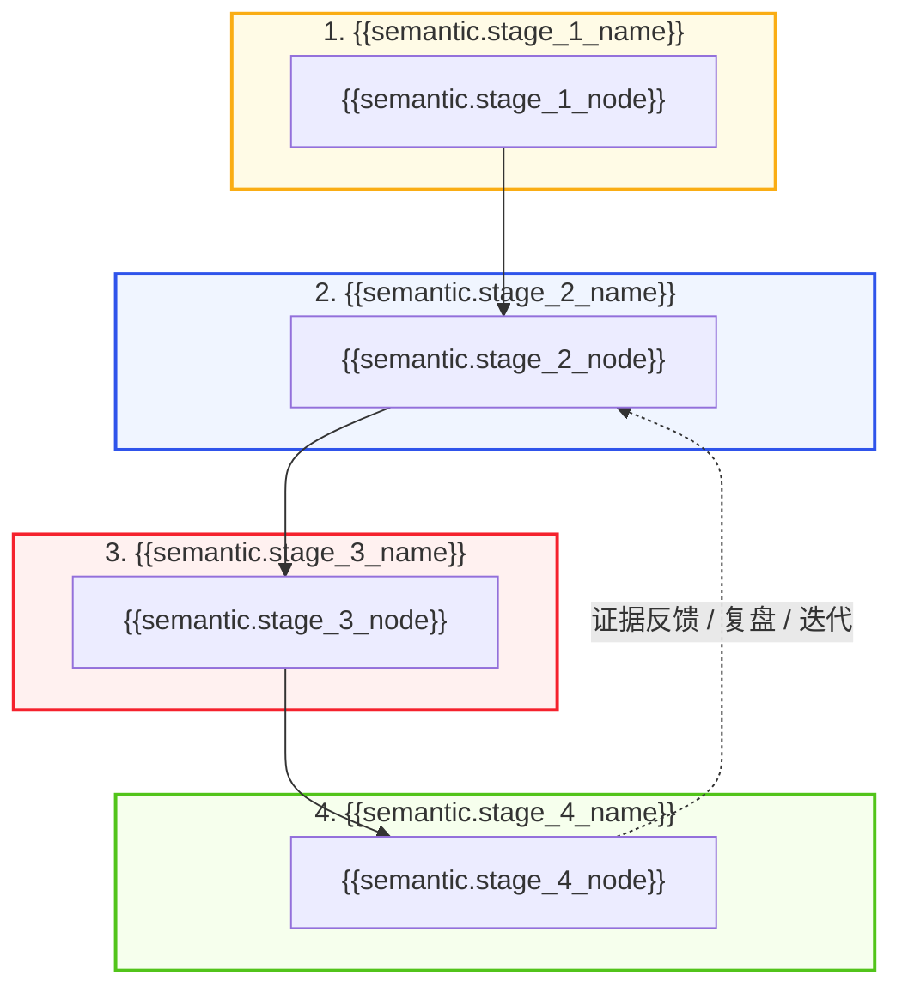

# {{title}}

<!-- Authoring rule: delete optional mechanism, metric, SOP, entity, or timeline blocks when evidence cannot support them. Never fill a structural slot with invented prose. -->

> [!NOTE] Core Thesis
> **核心论点 (Core Thesis):** {{semantic.core_thesis}}
> (Source: [[{{source_note}}#^{{thesis_anchor}}]])

^{{concept_slug}}-core-thesis

> [!INFO] Temporal Scope & Governance
> Valid as of **{{valid_as_of}}** · evidence **{{evidence_level}}** · freshness **{{freshness_tier}}** · next review **{{next_review}}**.

## 证据范围 (Evidence Scope) · 理解门 (Understanding Gates)

### 直接证据 (Direct Evidence)

1. {{semantic.direct_evidence_1}} (Source: [[{{source_note}}#^{{thesis_anchor}}]])
2. {{semantic.direct_evidence_2}} (Source: [[{{source_note}}#^{{evidence_anchor}}]])
3. {{semantic.direct_evidence_3}} (Source: [[{{source_note}}#^{{mechanism_anchor_1}}]])

- **推论与解释 (Interpretation):** {{semantic.interpretation}}
- **证据边界 (Evidence Boundary):** {{semantic.evidence_boundary}}
- **反模式 / 失效边界 (Anti-pattern):** {{semantic.anti_pattern}}
- **反证条件 (Falsifiers):** {{semantic.falsifier}}
- **理解增量 (What Changed):** {{semantic.understanding_delta}}
- **可复用动作 (Reusable Action):** {{semantic.reusable_action}}
- **Exact locators:** [[{{source_note}}#^{{thesis_anchor}}]], [[{{source_note}}#^{{evidence_anchor}}]], [[{{source_note}}#^{{mechanism_anchor_1}}]]

## 核心机制与认知拓扑 (Core Mechanisms & Viking Mindmap)

### 1. {{semantic.mechanism_1_title}}

- **机制原理:** {{semantic.mechanism_1_detail}} (Source: [[{{source_note}}#^{{mechanism_anchor_1}}]])

### 2. {{semantic.mechanism_2_title}}

- **机制原理:** {{semantic.mechanism_2_detail}} (Source: [[{{source_note}}#^{{mechanism_anchor_2}}]])

### 3. {{semantic.mechanism_3_title}}

- **机制原理:** {{semantic.mechanism_3_detail}} (Source: [[{{source_note}}#^{{mechanism_anchor_3}}]])

<!-- Optional mechanism 4: remove this block when the source does not support a distinct fourth mechanism. -->

### 4. {{semantic.mechanism_4_title}}

- **机制原理:** {{semantic.mechanism_4_detail}} (Source: [[{{source_note}}#^{{metric_anchor_1}}]])

### 四阶段机制流转拓扑 (Four-Stage Visual Topology)



## 范式对比矩阵 (Paradigm Matrix)

| 核心维度 | {{semantic.legacy_paradigm}} | {{semantic.intermediate_paradigm}} | {{semantic.new_paradigm}} |
| :--- | :--- | :--- | :--- |
| **{{semantic.dimension_1}}** | {{semantic.legacy_1}} | {{semantic.intermediate_1}} | **{{semantic.new_1}}** |
| **{{semantic.dimension_2}}** | {{semantic.legacy_2}} | {{semantic.intermediate_2}} | **{{semantic.new_2}}** |
| **{{semantic.dimension_3}}** | {{semantic.legacy_3}} | {{semantic.intermediate_3}} | **{{semantic.new_3}}** |
| **{{semantic.dimension_4}}** | {{semantic.legacy_4}} | {{semantic.intermediate_4}} | **{{semantic.new_4}}** |
| **{{semantic.dimension_5}}** | {{semantic.legacy_5}} | {{semantic.intermediate_5}} | **{{semantic.new_5}}** |
| **{{semantic.dimension_6}}** | {{semantic.legacy_6}} | {{semantic.intermediate_6}} | **{{semantic.new_6}}** |

## 关键数据与实证 (Key Data) · Benchmarks

- **{{semantic.metric_1_label}}:** {{semantic.metric_1_value}} (as of {{semantic.metric_1_as_of}}; Source: [[{{source_note}}#^{{metric_anchor_1}}]])
- **{{semantic.metric_2_label}}:** {{semantic.metric_2_value}} (as of {{semantic.metric_2_as_of}}; Source: [[{{source_note}}#^{{metric_anchor_2}}]])
- **{{semantic.metric_3_label}}:** {{semantic.metric_3_value}} (as of {{semantic.metric_3_as_of}}; Source: [[{{source_note}}#^{{mechanism_anchor_3}}]])

## 智能体接口与可观测性 (Agent Interface & Telemetry)

- **智能体角色 (Archetype):** `{{semantic.agent_role}}`
- **上下文层级 (Context Layer):** `{{semantic.context_layer}}`
- **工具调用映射 (Tool / MCP Grounding):** `{{semantic.tool_mapping}}`
- **输入契约 (Input Contract):** {{semantic.input_contract}}
- **输出契约 (Output Contract):** {{semantic.output_contract}}
- **核心遥测 (Telemetry):** {{semantic.telemetry_signal}}
- **停止条件 (Stop Condition):** {{semantic.stop_condition}}
- **查询模式 (JSON Schema):**

```json
{
  "concept_slug": "{{concept_slug}}",
  "agent_role": "{{semantic.agent_role}}",
  "context_layer": "{{semantic.context_layer}}",
  "input_contract": "{{semantic.input_contract}}",
  "output_contract": "{{semantic.output_contract}}",
  "telemetry": "{{semantic.telemetry_signal}}",
  "stop_condition": "{{semantic.stop_condition}}"
}
```

## 应用与工程含义 (Implications & SOP) · 人机协同落地指南

- **SOP ID:** `{{semantic.sop_id}}`
- **适用范围 (Scope):** {{semantic.sop_scope}}
- **触发条件 (Trigger):** {{semantic.sop_trigger}}

1. **{{semantic.sop_step_1_title}}:** {{semantic.sop_step_1_action}}
2. **{{semantic.sop_step_2_title}}:** {{semantic.sop_step_2_action}}
3. **{{semantic.sop_step_3_title}}:** {{semantic.sop_step_3_action}}
4. **{{semantic.sop_step_4_title}}:** {{semantic.sop_step_4_action}}

- **评价门 (Evaluation Gate):** {{semantic.evaluation_gate}}
- **治理与停止 (Governance Constraint):** {{semantic.governance_constraint}}

## 关联 (Connections) · 概念网络连接

- **领域 MOC:** [[{{moc_path}}]]
- **上游 / 并列概念:**
  - [[{{semantic.related_concept_1}}]] — {{semantic.related_concept_1_desc}}
  - [[{{semantic.related_concept_2}}]] — {{semantic.related_concept_2_desc}}
- **关键实体:** {{semantic.related_entity_1}} — {{semantic.related_entity_1_desc}}
- **不可变来源:** [[{{source_note}}]]

## 演化时间线 (Evolution Timeline)

- **{{valid_as_of}}:** Initial compiled understanding from [[{{source_note}}#^{{thesis_anchor}}]].
- **{{semantic.timeline_2_date}}:** {{semantic.timeline_2_event}} (Source: [[{{source_note}}#^{{evidence_anchor}}]]).
- **{{semantic.timeline_3_date}}:** {{semantic.timeline_3_event}} (Source: [[{{source_note}}#^{{mechanism_anchor_3}}]]).

## 开放问题与前瞻研究 (Open Questions)

1. {{semantic.open_question_1}}
2. {{semantic.open_question_2}}
