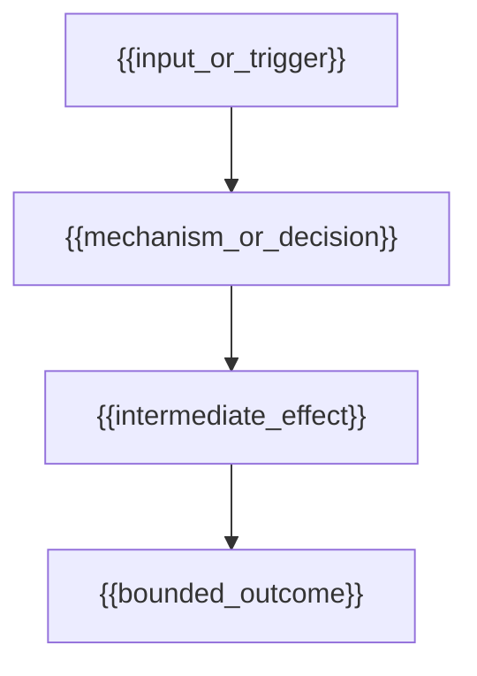

# {{title}} ({{chinese_title}})

> [!NOTE] Core Thesis
> {{core_thesis}}
> (Source: [[{{source_note}}#^{{thesis_anchor}}]])

> [!INFO] Temporal Scope
> Valid as of **{{valid_as_of}}** · freshness tier **{{freshness_tier}}** · next review **{{next_review}}**.

## 证据范围 (Evidence Scope)

- **Direct evidence:** {{direct_evidence}} (Source: [[{{source_note}}#^{{evidence_anchor}}]])
- **Interpretation:** {{interpretation}}
- **Evidence boundary:** {{evidence_boundary}}
- **Falsifier / counterpoint:** {{falsifier}}
- **Exact locators:** [[{{source_note}}#^{{thesis_anchor}}]], [[{{source_note}}#^{{evidence_anchor}}]]

## 核心机制 (Core Mechanisms)

### 1. {{mechanism_1_title}}

- {{mechanism_1_detail}} (Source: [[{{source_note}}#^{{mechanism_anchor_1}}]])

### 2. {{mechanism_2_title}}

- {{mechanism_2_detail}} (Source: [[{{source_note}}#^{{mechanism_anchor_2}}]])

### 3. {{mechanism_3_title}}

- {{mechanism_3_detail}} (Source: [[{{source_note}}#^{{mechanism_anchor_3}}]])

## 概念机制图 (Concept Mechanism)

<!-- Choose the topology that matches the evidence: causal loop, contrast flow, fork/join pipeline, or manager/worker heartbeat. Remove unused nodes. -->

## 范式对比矩阵 (Paradigm Matrix)

| Dimension | {{legacy_paradigm}} | {{new_paradigm}} |
|---|---|---|
| {{dimension_1}} | {{legacy_1}} | {{new_1}} |
| {{dimension_2}} | {{legacy_2}} | {{new_2}} |
| {{dimension_3}} | {{legacy_3}} | {{new_3}} |
| {{dimension_4}} | {{legacy_4}} | {{new_4}} |
| {{dimension_5}} | {{legacy_5}} | {{new_5}} |

## 关键数据与实证 (Key Data)

- **{{metric_1_label}}:** {{metric_1_value}} (as of {{metric_1_as_of}}; Source: [[{{source_note}}#^{{metric_anchor_1}}]])
- **{{metric_2_label}}:** {{metric_2_value}} (as of {{metric_2_as_of}}; Source: [[{{source_note}}#^{{metric_anchor_2}}]])

## 应用与工程含义 (Implications & SOP)

- **Actionable directive:** {{actionable_directive}}
- **Evaluation gate:** {{evaluation_gate}}
- **Governance constraint:** {{governance_constraint}}

## 关联 (Connections)

- **MOC:** [[{{moc_path}}]]
- **Related concepts:** [[{{related_concept_1}}]], [[{{related_concept_2}}]]
- **Entities:** [[{{related_entity_1}}]]
- **Source:** [[{{source_note}}]]

## 演化时间线 (Evolution Timeline)

- **{{valid_as_of}}:** Initial compiled understanding from [[{{source_note}}#^{{thesis_anchor}}]].

