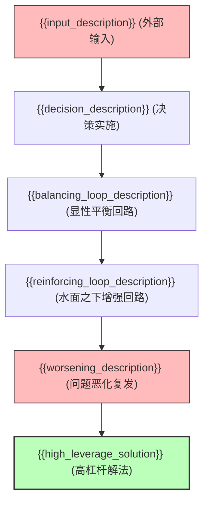

# {{title}} ({{chinese_title}})

> [!NOTE] Core Thesis
> {{core_thesis_paragraph}}

## 核心机制：{{mechanism_summary_title}} (Core Mechanisms)

### 1. {{sub_mechanism_1_title}}
- **{{sub_mechanism_1_point_1_label}}**：{{sub_mechanism_1_point_1_detail}}
- **{{sub_mechanism_1_point_2_label}}**：{{sub_mechanism_1_point_2_detail}} (Source: [[{{source_note}}#^ki-{{block_id_1}}]])

### 2. {{sub_mechanism_2_title}}
- **{{sub_mechanism_2_point_1_label}}**：{{sub_mechanism_2_point_1_detail}}
- **{{sub_mechanism_2_point_2_label}}**：{{sub_mechanism_2_point_2_detail}} (Source: [[{{source_note}}#^ki-{{block_id_2}}]])

### 3. {{sub_mechanism_3_title}}
- **{{sub_mechanism_3_point_1_label}}**：{{sub_mechanism_3_point_1_detail}}
- **{{sub_mechanism_3_point_2_label}}**：{{sub_mechanism_3_point_2_detail}} (Source: [[{{source_note}}#^ki-{{block_id_3}}]])

## {{legacy_paradigm_name}} vs {{new_paradigm_name}} 范式对比 ({{matrix_short_name}} Matrix)

| 维度 | {{legacy_paradigm_name}} | {{new_paradigm_name}} |
|---|---|---|
| **{{dimension_1_name}}** | {{legacy_dimension_1}} | {{new_dimension_1}} |
| **{{dimension_2_name}}** | {{legacy_dimension_2}} | {{new_dimension_2}} |
| **{{dimension_3_name}}** | {{legacy_dimension_3}} | {{new_dimension_3}} |
| **{{dimension_4_name}}** | {{legacy_dimension_4}} | {{new_dimension_4}} |

## 关键数据与实证 (Key Data)

- **{{key_metric_1_label}}**：{{key_metric_1_detail}}
- **{{key_metric_2_label}}**：{{key_metric_2_detail}}
- **{{key_metric_3_label}}**：{{key_metric_3_detail}}

## 关联

- 相关概念页：[[{{concept_stem_1}}]], [[{{concept_stem_2}}]], [[{{concept_stem_3}}]], [[{{concept_stem_4}}]]
- 相关实体页：[[{{entity_stem_1}}]], [[{{entity_stem_2}}]], [[{{entity_stem_3}}]]
- 相关源文件：[[{{source_stem}}]]

## 演化时间线 (Evolution Timeline)

- **{{evolution_date}}**：{{evolution_milestone_description}}
