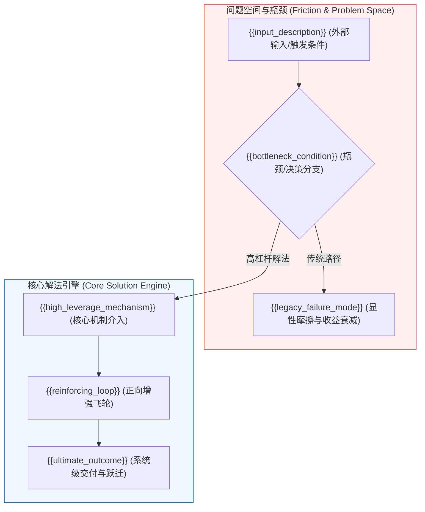

# {{title}} ({{chinese_title}})

> [!NOTE]
> **核心论点 (Core Thesis):** {{core_thesis_paragraph}}
> (Source: [[{{source_note}}#^{{anchor_id_1}}]]) {{single_source_warning}}

---

## 核心机制 (Core Mechanisms)

- **核心命题 (Thesis)**：{{thesis_statement}} (Source: [[{{source_note}}#^{{anchor_id_1}}]])
- **因果传导机制 (Causal Mechanism)**：
  1. {{step_1}}
  2. {{step_2}}
  3. {{step_3}}
  4. {{step_4}} (Source: [[{{source_note}}#^{{anchor_id_2}}]])
- **证据边界 (Evidence Boundary)**：{{evidence_boundary_statement}} (Source: [[{{source_note}}#^{{anchor_id_3}}]])
- **反证条件 (Falsifier)**：{{falsifier_statement}} (Source: [[{{source_note}}#^{{anchor_id_4}}]])
- **精确来源锚点 (Exact Locators)**：{{locators_summary}} (Source: [[{{source_note}}]])

---

## 概念机制图 (Concept Mechanism - Mermaid)

---

## 范式对比矩阵 (Paradigm Matrix)

| 核心维度 | {{legacy_paradigm_name}} (旧范式) | {{new_paradigm_name}} (新范式) |
| :--- | :--- | :--- |
| **{{dimension_1_name}}** | {{legacy_dimension_1}} | **{{new_dimension_1}}** |
| **{{dimension_2_name}}** | {{legacy_dimension_2}} | **{{new_dimension_2}}** |
| **{{dimension_3_name}}** | {{legacy_dimension_3}} | **{{new_dimension_3}}** |
| **{{dimension_4_name}}** | {{legacy_dimension_4}} | **{{new_dimension_4}}** |

---

## 关键数据与实证 (Key Data)

- **{{key_metric_1_label}}**：{{key_metric_1_detail}} (Source: [[{{source_note}}#^{{metric_anchor_1}}]])
- **{{key_metric_2_label}}**：{{key_metric_2_detail}} (Source: [[{{source_note}}#^{{metric_anchor_2}}]])
- **{{key_metric_3_label}}**：{{key_metric_3_detail}} (Source: [[{{source_note}}#^{{metric_anchor_3}}]])

---

## 应用与工程含义 (Implications & SOP)

- **操作指南 (Actionable Directive)**：{{actionable_directive}}
- **评测与质量门 (Evaluation Gate)**：{{evaluation_gate}}
- **治理与安全约束 (Governance Constraint)**：{{governance_constraint}}

---

## 概念网络连接 (Linkages)

- **上层方法论/MOC**：[[{{moc_stem_1}}]], [[{{moc_stem_2}}]]
- **底层支撑概念**：[[{{concept_stem_1}}]], [[{{concept_stem_2}}]]
- **关键实体档案**：[[{{entity_stem_1}}]], [[{{entity_stem_2}}]]
- **来源出处**：[[{{source_note}}]]

---

## 演化时间线 (Evolution Timeline)

- **{{evolution_date}}**：{{evolution_milestone_description}} (Source: [[{{source_note}}#^{{anchor_id_1}}]])
