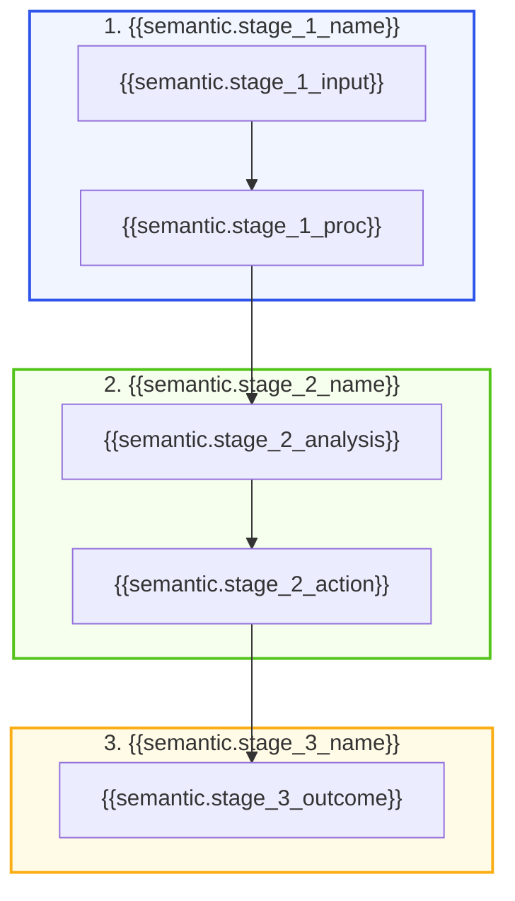

# {{deliverable_title}} ({{chinese_title}})

> [!IMPORTANT] Executive Summary
> **执行摘要 (Executive Summary):** **“{{semantic.executive_summary_statement}}”**

## 1. 战略背景与核心问题 (Context & Problem Statement)

{{semantic.context_paragraph}}

## 2. 核心推演与决策矩阵 (Analysis & Decision Framework)

## 3. 维度拆解与量化打分 (Quantitative Breakdown)

| 核心维度 | 权重 / 关键指标 | 评估得分 / 现状 | 核心结论与量化证据 |
| :--- | :---: | :---: | :--- |
| **{{semantic.dimension_1}}** | {{semantic.weight_1}} | **{{semantic.score_1}}** | {{semantic.evidence_1}} |
| **{{semantic.dimension_2}}** | {{semantic.weight_2}} | **{{semantic.score_2}}** | {{semantic.evidence_2}} |
| **{{semantic.dimension_3}}** | {{semantic.weight_3}} | **{{semantic.score_3}}** | {{semantic.evidence_3}} |

## 4. 行动步骤与执行路线 (Implementation Roadmap)

| 阶段 | 关键动作 (Action Item) | 负责角色 (DRI) | 交付成果 (Deliverable) | 完成时限 |
| :--- | :--- | :--- | :--- | :--- |
| **阶段 1** | {{semantic.action_1}} | {{semantic.dri_1}} | {{semantic.result_1}} | T + 7 Days |
| **阶段 2** | {{semantic.action_2}} | {{semantic.dri_2}} | {{semantic.result_2}} | T + 14 Days |
| **阶段 3** | {{semantic.action_3}} | {{semantic.dri_3}} | {{semantic.result_3}} | T + 30 Days |

## 5. 支撑资产与参考来源 (Supporting Knowledge Graph)

- **核心概念:**
  - [[wiki/concepts/{{domain}}/{{concept_1}}]]
  - [[wiki/concepts/{{domain}}/{{concept_2}}]]
- **不可变来源:**
  - [[{{source_note}}]]
