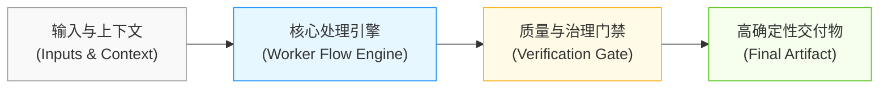

# {{output_title}}

> [!NOTE]
> **执行摘要 (Executive Summary):** {{executive_summary}}

---

## 一、战略背景与问题定义 (Context & Problem Definition)

- **核心矛盾与痛点**：{{core_problem_statement}}
- **受影响范围与利益相关者**：{{stakeholders_impact}}
- **既有方案的局限性**：{{legacy_solutions_limitation}}

---

## 二、机制解法与交付架构 (Architecture & Mechanism)

- **第一阶段 (Phase 1)**：{{phase_1_details}}
- **第二阶段 (Phase 2)**：{{phase_2_details}}
- **第三阶段 (Phase 3)**：{{phase_3_details}}

---

## 三、实证依据与支撑概念 (Grounding Concepts & Evidence)

| 交付模块 | 支撑概念卡 | 核心实证来源 | 关键论证 |
| :--- | :--- | :--- | :--- |
| **模块 1** | [[{{concept_1}}]] | [[{{source_1}}#^{{anchor_1}}]] | {{evidence_1_summary}} |
| **模块 2** | [[{{concept_2}}]] | [[{{source_2}}#^{{anchor_2}}]] | {{evidence_2_summary}} |
| **模块 3** | [[{{concept_3}}]] | [[{{source_3}}#^{{anchor_3}}]] | {{evidence_3_summary}} |

---

## 四、行动清单与决策路径 (Action Items & Decision Path)

- [ ] **Next Action 1 (P0)**：{{action_1}} (Owner: {{owner_1}}, Deadline: {{deadline_1}})
- [ ] **Next Action 2 (P1)**：{{action_2}} (Owner: {{owner_2}}, Deadline: {{deadline_2}})
- [ ] **Next Action 3 (P2)**：{{action_3}} (Owner: {{owner_3}}, Deadline: {{deadline_3}})

---

## 五、风险防范与证伪条件 (Risks & Falsifiers)

> [!WARNING]
> **证伪边界 (Falsifiers):** {{falsifier_conditions}}
