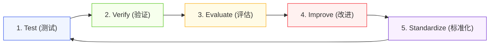

# Third Brain V8.1 — 架构演进与 STOW 体系评估

> **结论**：第三大脑 V8.1.0 架构全面确立 **5-Stage Worker 流水线** 与 **V8.1 黄金标准概念卡片规范**。系统在不可变事实来源（SHA-256 + 块级锚点）、13 领域概念建模、5 类实体索引、4 层地图导航及自动化治理门禁上实现了全链路闭环与强类型约束。

---

## 1. STOW 体系全生命周期评估 (STOW Evaluation)

| 阶段 (Stage) | 架构标准与契约要求 | V8.1 覆盖与实现 | 核心演化与增强 |
| :--- | :--- | :--- | :--- |
| **Source (摄取)** | 外部世界、音视频访谈、论文、研报 | `sources/YYYY-MM/` 按月归档 | **不可变事实收据**：强制写入 SHA-256 哈希与段落级块锚点 `^anchor`；剪报归档至 `Clippings/archive/`（保持 Inbox Zero）。 |
| **Think (认知)** | 概念建模、机制拆解、范式对比、SOP 提炼 | `wiki/concepts/<domain>/` | **V8.1 黄金标准十段式结构**：Core Thesis（带锚点） + Temporal Scope + 证据四分法 + 3阶段彩色 Mermaid 拓扑 + 多维对比矩阵。 |
| **Organize (图谱)** | 实体索引、领域 MOC、双向链接编织 | `wiki/entities/`, `maps/domain-mocs/` | **0 悬空死链与双向连通**：13 领域 MOC 与 `Home.md` / `中央索引.md` 实时对齐，实体桩强制存在。 |
| **Write (交付)** | 决策简报、评估研报、架构备忘录、OKR 成果 | `wiki/outputs/` | **高确定性决策交付**：显式声明支撑概念矩阵与证伪风险条件，实现知识到商业与行为的闭环。 |

---

## 2. MECE 架构完备性评估 (MECE Assessment)

| 评估维度 | 评分 | 评估依据与架构支撑 |
| :--- | :---: | :--- |
| **相互独立 (Mutually Exclusive)** | **5/5** | 13 个概念领域与 5 个实体类别边界清晰，事实层（`sources/`）、概念层（`wiki/concepts/`）与交付层（`wiki/outputs/`）完全解耦。 |
| **完全穷尽 (Collectively Exhaustive)** | **5/5** | 覆盖从最底层不可变证据、中间认知模型、高阶图谱导航到最终业务/投资决策输出的全流程。 |
| **可执行性 (Actionability)** | **5/5** | 概念卡片强制包含落地与实践指南 (SOP)，输出页直接对接项目执行与 OKR。 |
| **可审计性 (Auditability)** | **5/5** | `system/lint-report.md`、`system/governance-dashboard.md` 与自动化测试套件提供 100% 确定性校验。 |
| **技能对齐 (Skill Alignment)** | **5/5** | `third-brain-v5-skills` 中的 21 个 Agent Skills 与 Obsidian Vault 契约完全对齐，支持多智能体并发协同。 |

---

## 3. 测试-验证-改进-标准化闭环 (TVIS Cycle)

1. **Test**：通过实际剪报（如 Palo Alto Networks、Stripe x a16z、英伟达 Cosmos）运行完整端到端摄取。
2. **Verify**：检查 SHA-256 哈希、块锚点引用、Mermaid 渲染、YAML 语法与双向链接完整性。
3. **Evaluate**：评估概念卡片的信息密度、因果解释力与反 Cliché 标准。
4. **Improve**：优化自动化脚本与模板字段，消除任何歧义或冗余。
5. **Standardize**：固化至 `system/templates/`、`system/schema.md`、`system/config.md` 与 `contracts/`。
