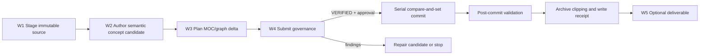

# Obsidian V8.1 Transactional Worker Flow

The machine authority is `contracts/vault-contract.json`; the canonical entry point is:

```text
python -m tools.worker_flow.cli --vault <explicit-vault-root> --repo <repo-root> <command>
```

Legacy scripts under `tools/` are compatibility audits only. They do not author, move, archive, heal, or publish Vault files.

## Pipeline



W1–W4 are the required ingest transaction. W5 is an explicit support lane after a verified commit; it is not evidence that an automatic deliverable renderer exists.

## Worker contracts

### W1 — Ingest

- Read one explicit clipping or repository-local input.
- Preserve the full source bytes, SHA-256, provenance fields, and 3–7 resolvable block anchors.
- Stage only. Do not mutate the canonical source tree or archive the input.

### W2 — Cognitive authoring

- Start from the versioned concept template.
- Host rendering resolves every deterministic token and leaves only registered `semantic.*` tokens.
- An author resolves all semantic tokens with evidence boundaries, falsifiers, mechanisms, and exact locators.
- Unresolved placeholders are a P0 governance failure.

### W3 — GraphWeaver

- Produce a typed MOC/map delta from candidate metadata.
- Recheck shared-target preimages immediately before commit.
- Do not rewrite immutable source notes to repair taxonomy or link debt.

### W4 — Governance and integration

- Validate schemas, contract/template versions, taxonomy, source IDs, all linked-note anchors, wikilink ambiguity, freshness, and touched-set regressions.
- `submit` is read-only over canonical Vault state.
- `commit` requires explicit approval and serial integration ownership.
- On any preimage drift, stop before the first canonical write.
- Archive only after canonical writes and post-commit checks succeed. Recovery never overwrites concurrent edits.

### W5 — Deliverable support

- Use `template-output-deliverable-v8.1.md` and the output schema.
- Treat authoring as a separate reviewed task grounded in committed concepts and immutable sources.
- The stable output template is a byte-identical compatibility alias.

## State sequence

```text
CLAIMED -> STAGED -> AUTHORED -> VERIFIED -> COMMITTED -> ARCHIVED
```

`NO_OP`, `NEEDS_INPUT`, `INSUFFICIENT_EVIDENCE`, `BLOCKED_PERMISSION`, `BLOCKED_DEPENDENCY`, `VERIFY_FAILED`, and `BUDGET_STOP` are valid terminal or retryable outcomes. Activity alone is never success.

## Required verification

```powershell
python -B tools/lint-agent-skills.py
python -B -m unittest discover -s tools -p "test_*.py" -v
python -B -m unittest discover -s tests -p "test_*.py" -v
python -B -m unittest discover -s experiments/graph-engineering/tests -p "test_*.py" -v
git diff --check
```

Test counts are intentionally not hard-coded. The receipt records the observed count, exit code, and final repository bytes.

## Live Vault boundary

Before a live deployment, freeze the repository bundle identity and target preimages, record protected-tree hashes for `Clippings/`, `sources/`, `wiki/`, and `maps/`, then use `prepare-system -> submit -> commit --approve-commit`. Any changed repository hash or Vault preimage invalidates the plan and requires restaging.
