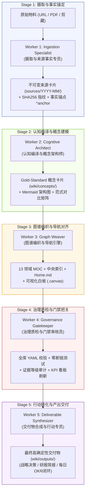

# Obsidian Wiki Multi-Agent Worker Flows Specification (OCD V8.0)

> **LLM-OS Architecture:** LLM=CPU · Context=RAM · Storage=Obsidian Disk · Tools=System Calls · Skills=Programs · Harness=Kernel · Worker Flows=Pipelines & Processes.

本规范定义了知识库从“散乱信息捕获”到“结构化概念沉淀”再到“高价值行动交付”的 5 阶段多智能体协作流水线（5-Stage Worker Assembly Pipeline）。每个 Worker 均具备严格的契约（Contract）、输入输出边界、质量门禁（DoD）与失败回滚机制。

---

## 🏗️ 5-Stage Worker 流水线总览



---

## 📋 详细 Worker 角色与执行标准

### 1. Worker 1: 摄取与事实锚定专员 (Ingestion Specialist)
- **核心技能**：`wiki-ingest`
- **职能职责**：
  - 监控 `01_inbox/` 与 `Clippings/` 目录。
  - 校验输入元数据，计算 SHA-256 唯一内容哈希。
  - 生成 `sources/YYYY-MM/` 规范化不可变来源卡，保留原始转录与核心观点。
  - 提炼 3~7 条原子事实，并打上唯一稳定的块引用锚点（`^anchor-name`）。
  - 将原始剪藏移至 `Clippings/archive/`，实现收件箱零积压（Inbox Zero）。
- **DoD 验收标准**：
  - [x] Frontmatter 包含完整 `source_id`, `hash`, `date`, `evidence_level`
  - [x] 所有核心观点均带有精确 `^anchor`
  - [x] 原始剪藏文件成功归档

---

### 2. Worker 2: 认知编译与概念架构师 (Cognitive Architect)
- **核心技能**：`cognitive-compile`, `wiki-ingest`
- **职能职责**：
  - 从来源事实中提取核心论点（Core Thesis），放入 `> [!NOTE]` 提示框。
  - 拆解多步因果传导机制（Causal Chain），并明确标注反证条件（Falsifiers）与证据边界。
  - 绘制语法严密的 Mermaid 机制流程图（`flowchart TD` 或 `stateDiagram-v2`）。
  - 构造四维范式对比矩阵（Paradigm Matrix），清晰对比新旧模式。
  - 严格根据 13 领域分类体系落盘至 `wiki/concepts/<domain>/`。
- **DoD 验收标准**：
  - [x] 包含完整的 8 大标准板块（Frontmatter、Thesis、Mechanisms、Mermaid、Matrix、Data、Implications、Linkages）
  - [x] 引用来源全部使用精确块引用（`[[sources/...#^anchor]]`）
  - [x] 绝无模糊空洞的纯摘要，必须具备机制因果与反证条件

---

### 3. Worker 3: 图谱编织与导航引擎 (Graph Weaver)
- **核心技能**：`knowledge-ops`, `graph-engineering`
- **职能职责**：
  - 将新生成的概念卡片与实体卡片双向回挂至对应的 13 领域 MOC（`maps/domain-mocs/`）。
  - 同步更新中央导航入口：[`maps/Home.md`](file:///C:/Users/高杰/Documents/Obsidian%20Vault/maps/Home.md) 与 [`maps/中央索引.md`](file:///C:/Users/高杰/Documents/Obsidian%20Vault/maps/%E4%B8%AD%E5%A4%AE%E7%B4%A2%E5%BC%95.md)。
  - 对重大架构与知识主干，同步更新/创建对应的 Obsidian 白板画布（`maps/canvases/*.canvas`）。
  - 维持全库概念的双向链接密度（每张卡片至少 2 个上游/下游关联）。
- **DoD 验收标准**：
  - [x] 对应领域 MOC 顶部已挂载最新条目与一句话导读
  - [x] 中央索引 Source / Concept 计数与清单实时更新
  - [x] 概念卡具备指向 MOC 或父级概念的双向链接

---

### 4. Worker 4: 治理质检与门禁把关员 (Governance Gatekeeper)
- **核心技能**：`wiki-lint`, `verify-before-claim`
- **职能职责**：
  - 扫描全库所有 Markdown 文件的 YAML Frontmatter，执行 100% 语法与类型校验。
  - 执行全局链接审计（Link Audit），确保零悬空链接、零错误路径。
  - 校验块引用有效性（Block Ref Resolvability），确保 `^anchor` 目标真实存在。
  - 运行系统回归测试套件（`test-agent-wiki-flywheel.ps1` 与 `update-system-kpi.ps1`）。
  - 刷新治理看板（`system/governance-dashboard.md` 与 `system/auto-update-report.md`）。
- **DoD 验收标准**：
  - [x] 0 个 YAML 语法/标点错误
  - [x] 0 个不可解析的源码块引用断链
  - [x] 单元测试套件 100% PASS

---

### 5. Worker 5: 交付物合成与行动专员 (Deliverable Synthesizer)
- **核心技能**：`daily-okr`, `project-flow-ops`, `session-learn`
- **职能职责**：
  - 基于已沉淀的概念网络与实证来源，跨域合成最终高价值交付物（Deliverable Artifacts）。
  - 产出物归档至 `wiki/outputs/`（如 Gmail 每日研究简报、深度项目评估报告、投资尽调备忘录）。
  - 将关键战略取舍与决策写入 `wiki/decisions/`。
  - 驱动每日复盘与知识复利闭环，记录至 `system/daily/YYYY-MM-DD-daily-knowledge-loop.md`。
- **DoD 验收标准**：
  - [x] 交付物具备清晰的执行摘要、支撑概念溯源表与明确的 P0/P1 行动清单（Next Actions）
  - [x] 每日 OKR 完成 7 阶段闭环评分并生成收据

---

## ⚡ Multi-Agent 协作调用范式 (Agent IPC)

在 Antigravity / Claude Code / Codex 环境中，Primary Commander 可通过如下结构化事件总线（IPC Ledger）调度 Worker：

```json
{
  "run_id": "run-20260815-220000",
  "pipeline": "Obsidian-Wiki-OCD-V8",
  "steps": [
    { "worker": "Worker-Ingest", "status": "DONE", "output": "sources/2026-08/src-example.md" },
    { "worker": "Worker-Cognitive", "status": "DONE", "output": "wiki/concepts/ai-engineering/example.md" },
    { "worker": "Worker-GraphWeaver", "status": "DONE", "output": "maps/domain-mocs/AI 知识工作流.md" },
    { "worker": "Worker-Governance", "status": "DONE", "output": "system/governance-dashboard.md" },
    { "worker": "Worker-Deliverable", "status": "DONE", "output": "wiki/outputs/evaluations/example-eval.md" }
  ],
  "verification_receipt": {
    "exit_code": 0,
    "tests_passed": 43,
    "broken_links": 0
  }
}
```
